##Getting Started: Normal Mode
###1. Overview
MadeiraCloud groups your resources and manages them as a single unit, either an “App” or a “Stack”. The concept is similar to VMware's vApp and OVF:

- A Stack is a template of an application containing everything that's needed to run it, e.g., code, servers, storage, network configuration, etc., but in a static, re-usable form.
- An App is a live instance of a Stack. When launching a Stack, all of its component resources will be provisioned and configured as specified in the Stack to create a running version as an App. Apps can be monitored and managed as one entity, making backups easy.

Put simply, an App is everything to do with a running setup and a Stack is like a snapshot or image of an entire App. Stacks are reusable so they can be launched into multiple apps which will then each have their own unique component resources with no conflicts.

###2. Connecting MadeiraCloud and AWS
An Amazon Web Services account is required in order to get full functionality from MadeiraCloud.

####2.1 Prerequisites
- If you haven't already, please <a href="http://aws.amazon.com/">sign up for an AWS account</a> (EC2 is mandatory).
- And obviously, a Madeira account is also required. You can sign up for a <a href="https://my.madeiracloud.com/user/register">free account here</a>.

####2.2 Entering your Credentials
The next step is to let us know your AWS account credentials in order for MadeiraCloud to connect with AWS on your behalf.

You should be promped at your first connection to <a href="https://ide.madeiracloud.com/v2/">MadeiraCloud IDE</a>. If not, or if you want to update your credentials, login to <a href="https://ide.madeiracloud.com/v2/">MadeiraCloud IDE</a>, then click on your username on the top-right corner and "AWS Credential".

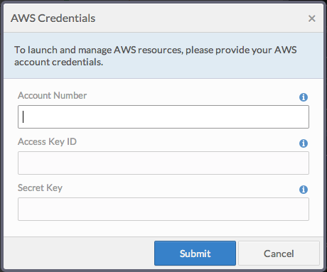

You can find your AWS credentials by clicking <a href="https://aws-portal.amazon.com/gp/aws/securityCredentials">here</a> or selecting 'Security Credentials' from the 'My Account/Console' menu:

After logging in, you can find your Account Number in the top right of the page, just under your username:

This is optional, but is needed for some advanced features such as sharing an EC2 AMI or EBS snapshot with other users.

Your Access Key and Secret Access Key can be found on the same page, under access credentials:

This is required in order for us to use AWS' Rest APIs to let you manage your AWS account through our application.

Just copy and paste these three pieces of information in to your Madeira AWS page, hit save and you are done.

###2b. Connecting MadeiraCloud and AWS using IAM
####Make sure IAM access is enabled.
Log in to your AWS account and then go <a href="https://aws-portal.amazon.com/gp/aws/manageYourAccount">here</a>.

Scroll down to the IAM user access section and make sure both the 'Account Activity Page' and 'Usage Reports Page' checkboxes are ticked and then click Activate Now.

####Create a user for use with MadeiraCloud.
Go to the AWS Console and click the <a href="https://console.aws.amazon.com/iam/home">IAM tab</a>, then create a group for your user. You can call it anything you like, but something Madeira related probably makes sense!

Click 'Select' after 'Amazon EC2 Full Access'.

Here you can review the permissions. If you are happy, click 'Continue'.

Then click the 'Create New Users' tab and enter a name for the new user. Leave 'Generate an access key for each User' ticked and then click 'Continue'.

Review your settings and click 'Finish'.

The IAM account has now been created. Click 'Show User Security Credentials'.

You can now see the Access Key ID and Secret Access Key for this user.

Copy and paste these into your Madeira <a href="https://my.madeiracloud.com/user/me/edit/AWS">AWS Credentials</a> page and click 'Save' and you're done!

###3. Designing a simple Stack (Drupal MySQL HA example)
For this example, we're going to create a simple Stack for quickly deploying a Drupal CMS site with MySQL master and slave databases.

1. Log in to the <a href="https://ide.madeiracloud.com/v2/">IDE</a>
2. Create a new Stack by clicking "Create new Stack" on the top left of the IDE dashboard
3. Choose the <a href="http://aws.amazon.com/about-aws/globalinfrastructure/regional-product-services/">AWS region</a> where you want to create your Stack 
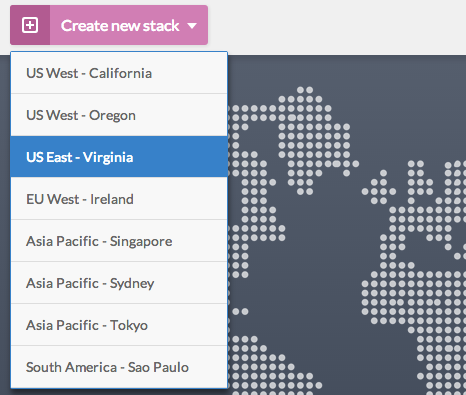
4. Select "Classic" in the following menu (see <a href="" style="color: red;">VPC mode - Part xxx</a> for VPC) 
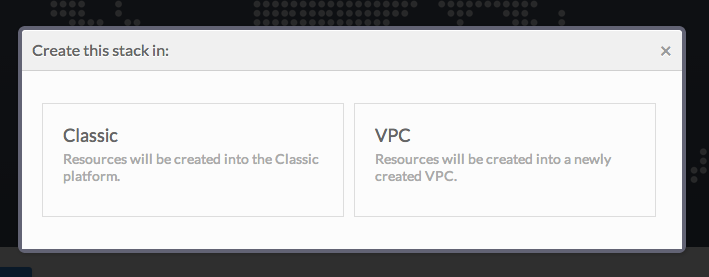
5. From the resource panel on the left, select the <a href="http://docs.aws.amazon.com/AWSEC2/latest/UserGuide/using-regions-availability-zones.html">Availability Zone</a> of your choice and drag'n'drop it to the canvas (Note: Availability Zones depend on regions) 
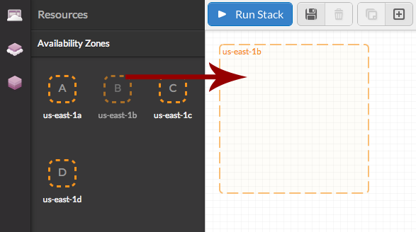
6. Following the same principle, drag'n'drop 3 instances ('Images' menu) inside the previously created Availability Zone (Note: We will use 64bits Amazon Linux AMIs in this example) 
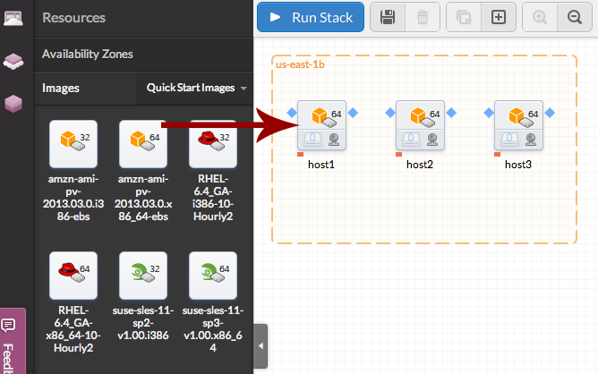
7. Click on each AMI icon and set the hostnames to the following in the right pannel 
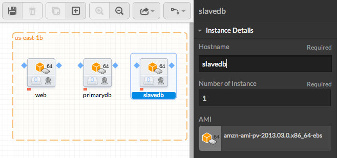
8. Associate an EIP to every instance. Pay attention to keep them associated until the execution of the Stack (the icon should be colored) 
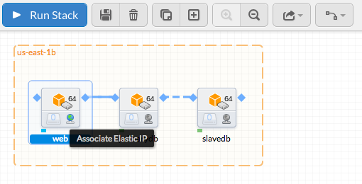
9. Define two <a href="http://docs.aws.amazon.com/AWSEC2/latest/UserGuide/using-network-security.html">Security Groups</a>, one for the front-end web server and one for the two back-end database servers  
Click on the web instance and then "Create new Security Group" in the "Security Groups" menu in the right pannel: 
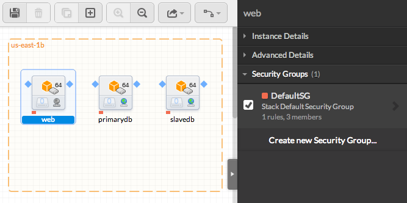 
Name this Security Group "front": 
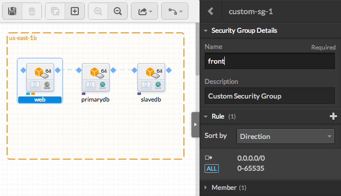 
Go back and assign the web instance to "front", then remove it from the default Security Group: 
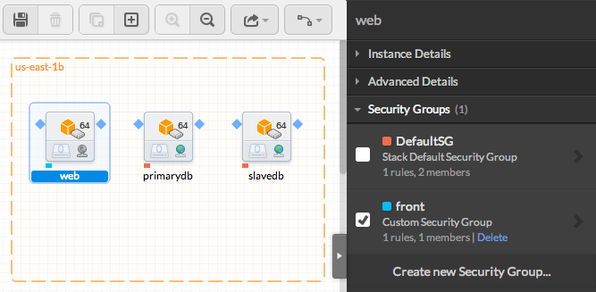 
Repeat the same operation to create a new "back" Security Group: 
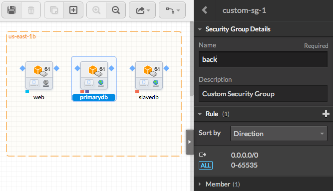 
Then add the two "primarydb" and "slavedb" instances to the "back" Security Group, removing them from the default SG. 
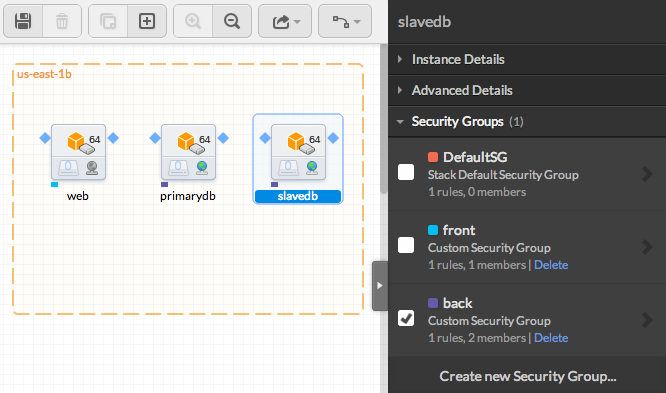 
10. Create the Security Rules to link the instances together  
Click on one of the "back" instances, then in the "Security Groups" menu in the right pannel, click on the right arrow on the right of the "back" SG to access its properties. 
In this menu, click on the "+" button to add a new rule. 
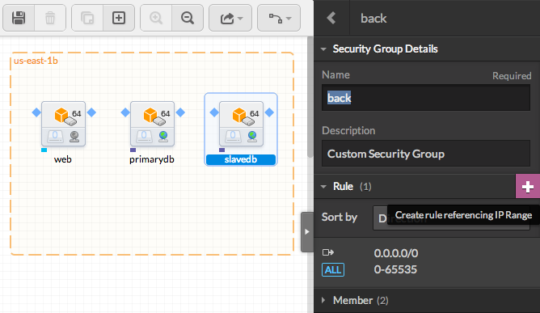 
Start by adding a first rule allowing the <a href="http://www.openssh.org/">SSH</a> connection to your instances (allow all connections from port 22, following TCP protocol, inbound) for remote management (note: the source(s) IP(s)/range must follow the <a href="http://en.wikipedia.org/wiki/Classless_Inter-Domain_Routing">CIDR</a> notation). 
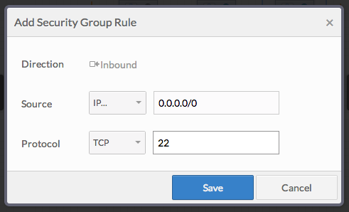 
Add a new rule to allow SQL connections from the "front" Security Group (port 3306, TCP). 
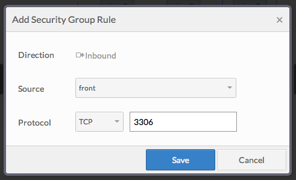 
Following the same method, add a new rule to allow all TCP traffic between all the instances of this Security Group (ports 1-65535). You may as well want to allow all UDP and ICMP traffic. 
You should at least have the following rules: 
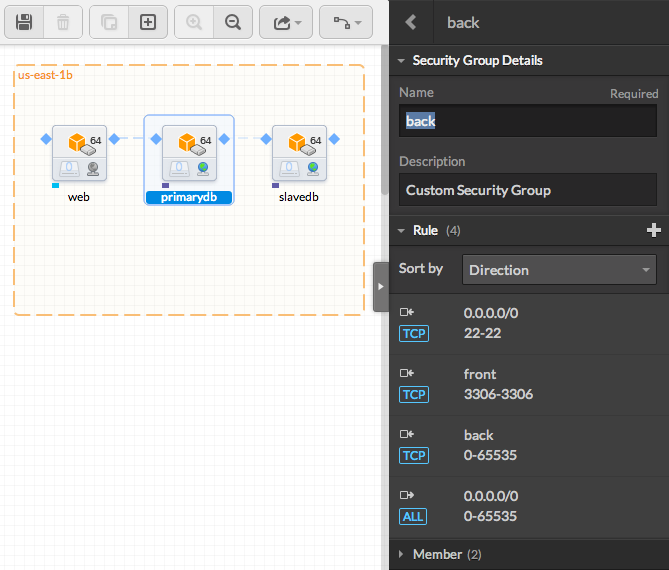 
Repeat the same operation for the "front" Security Group, in order to get the following rules. 
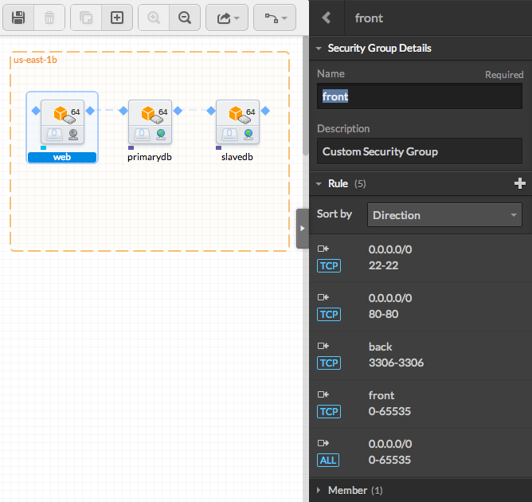  
Congratulations! Your Stack is now set and ready to be launched!  
11. Click on the blank area of the canvas to put the focus on the Stack properties. Name the Stack as "drupal-mysql-ha" in the right pannel, then click on the same icon on the left side of the top bar. 
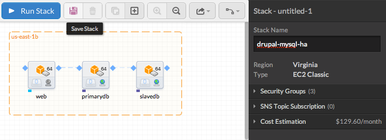 
12. Launch the Stack by clicking on the "Run Stack" button. 
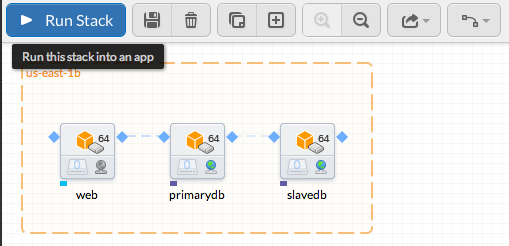 
13. Name the App in the pop-up window, then click on "Run Stack". 
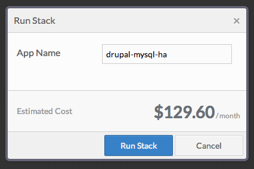 
14. Wait until the App to be launched. 
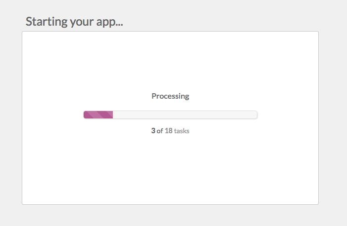 
15. Once started, your App should looks like the following: 
 
16. Click on the web instance to get the instance properties. You can see here all details concerning the running instance on the right pannel. We will pay attention here to the "Primary Public IP" and the "Key Pair". 
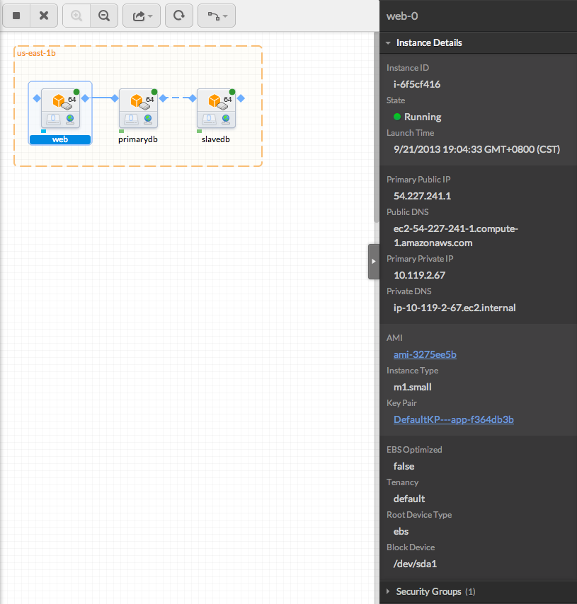 
16. You can now click on the link under "Key Pair" ("DefaultKP---app-f364db3b" here) to download the key file and get the standard SSH connection command. 
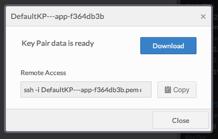 

###4. Setting up your application (Drupal MySQL HA example)
After following the steps in <a href="" style="color:red;">Part 3 - Designing a simple Stack</a>, your application is now running, and you have downloaded the KeyPair for the application.

You will now need to SSH into the web instance.
You can use any terminal client to do so. If you are running under Windows, which doesn't have any SSH compatible terminal embedded, we recomment PuTTY. In this case, you will also need to know how to <a href="http://docs.aws.amazon.com/AWSEC2/latest/UserGuide/putty.html?r=madeira">connect to Linux/UNIX Instances from PuTTY</a>.

####Disclamer
Please, be aware that these steps are informative, given as an example, and may differ (more, or less) from the reality, due to anyone's configuration.

We can't provide any warranty or support if you face issues during this phase, then be sure of what you are doing while setting up your applications.

####Setting up the instances
In this example, all the instances are running Amazon Linux, so write:

- `curl -s http://download.madeiracloud.com/setup/amazon.sh | sh"`

to the terminal for each instance as the root user.

####Deploying Drupal
SSH into the 'web' instance and write the following commands in order to install Drupal:

1. `sudo su -`
2. `yum install -y httpd php php-gd php-mysql php-xml php-mbstring mysql`
3. `chkconfig httpd on`
4. `cd /var/www/html/`
5. `wget http://ftp.drupal.org/files/projects/drupal-x.xx.tar.gz` (replace `x.xx` with the latest version number from the <a href="http://drupal.org/project/drupal">Drupal site</a>.)
6. `tar xzf drupal-x.xx.tar.gz` (replace `x.xx` by your version number)
7. `rm drupal-x.xx.tar.gz` (then type `y` to confirm)
8. `mv drupal-x.xx/* .`
9. `rm -rf drupal-x.xx/`
10. `mkdir -p /var/www/html/sites/default/files`
11. `cp sites/default/default.settings.php sites/default/settings.php`
12. `chmod 757 -R /var/www/html/sites/default/files`
13. `chmod 646 /var/www/html/sites/default/settings.php`
14. `service httpd start`

####Configure the primarydb
SSH into the 'primarydb' instance and write the following commands in order to configure the databases:

1. `sudo su -`
2. `chkconfig mysqld on`
3. `service mysqld start`
4. `/usr/bin/mysqladmin -u root password xxx` (replace `xxx` with a secure password of your choice)
5. `mysql -u root -p` (then enter your password and press enter)
6. `GRANT ALL ON *.* TO root@'%' IDENTIFIED BY 'letmein' WITH GRANT OPTION;`
7. `FLUSH PRIVILEGES;`
8. `CREATE DATABASE drupal;` (or replace `drupal` with a database name of your choice)

####Setting up Drupal
Open your browser and access: http://{web-public-hostname}:

1. Select the type of installation you would like and click `Save and Continue`
2. Select a language and click `Save and Continue`
3. Leave `Database type` as `MySQL, MariaDB, or equivalent`
4. Enter the name you entered earlier for `Database name`, e.g., `drupal`
5. For `Database username` enter `root`
6. For `Database password` enter the password you entered earlier, e.g., `xxx`
7. Click to expand `ADVANCED OPTIONS`
8. For `Database host` enter `primarydb`
9. For `Database port` enter `3306` and click `Save and Continue`
10. Complete the remainder of the Drupal wizard

####Setting up MySQL HA
SSH into primarydb and write the following commands:

1. `sudo su -`
2. `mysql -u root -p` (then enter password and hit enter)
3. `GRANT REPLICATION SLAVE, REPLICATION CLIENT ON *.* TO root@'slave_db' IDENTIFIED BY 'xxx';` (replace `xxx` by your mysql password)
4. `FLUSH PRIVILEGES;` (Then press Ctrl-C to quit MySQL)
5. `nano /etc/my.cnf` (or use the editor of your choice, as `vi` or `emacs`)
6. at the end of the first block, after `symbolic-links=0` and before `[mysqld_safe]` paste the following: <pre>log-bin = mysql-bin server-id = 1</pre>then save and quit (Ctrl-X)
7. `/etc/init.d/mysqld restart`

Now SSH into slavedb and write the following commands:

1. `sudo su -`
2. `nano /etc/my.cnf`
3. at the end of the first block, after `symbolic-links=0` and before `[mysqld_safe]` paste the following): <pre>log-bin = mysql-bin server-id = 2 relay-log = mysql-relay-bin log-slave-updates = 1 read-only = 1</pre>
4. `/etc/init.d/mysqld restart`

And back to primarydb:

1. `mysqldump -u root -p --all-databases --master-data=2 > dump.db`
2. Copy this file to the slave_db instance

And back to slavedb:

1. Go to the directory you copied `dump.db`
2. `/etc/init.d/mysqld restart`
3. `mysql -u root`
4. `GRANT ALL ON *.* TO root@'%' IDENTIFIED BY 'letmein' WITH GRANT OPTION;`
5. `FLUSH PRIVILEGES;` (Then press Ctrl-C to quit MySQL)
6. `mysql -u root < dump.db`
7. `mysql -u root`
8. Now you need to open your local copy of `dump.db` and search for `MASTER_LOG_FILE` and `MASTER_LOG_POS`, noting their values and replacing them in the following line:
`CHANGE MASTER TO master_host='primarydb', master_user='root', master_password='letmein', master_log_file='mysql-bin.000001', master_log_pos=106;`
9. `START SLAVE;`

##Getting Started: Virtual Private Cloud (VPC) Mode
###1. Overview of VPC and AWS Platforms
A Virtual Private Cloud (or VPC) is a virtual network of logically isolated EC2 instances and an optional VPN connection to your own datacenter. This allows greater security than the classic EC2 system. Amazon announced that they are changing to VPC by default to all new users on a region by region basis.

This means that there are two platforms (EC2-Classic and EC2-VPC) and scenarios (Previously used regions and never used regions):
<table><tbody><tr><th>Had the region been used before this change?</th>
<th>Unspecified VPC</th>
<th>Specified VPC</th>
</tr><tr><td>Yes</td>
<td>EC2-Classic</td>
<td>EC2-VPC (non-default VPC)</td>
</tr><tr></tr><tr><td>No</td>
<td>EC2-VPC (default VPC)</td>
<td>EC2-VPC (non-default VPC)</td>
</tr></tbody></table>

Let's go through each one:

####EC2-Classic
This is the same as what was previously just called EC2. If your account was created before AWS made this change and you have previously used the region (or AWS has not yet made the change in the region) then you will have the option to use EC2-Classic.

####EC2-VPC (non-default VPC)
Creating a non-default (custom) VPC is the same as what was previously just called VPC. No matter when you created your account or if you have used the region before or not, you will have access to this and there is no change to creating a custom VPC.

So EC2 is now called EC2-Classic and is restricted to older users and VPC is now part of EC2-VPC when a custom VPC is created and is available to everyone. So what's new?

####EC2-VPC (default VPC)
EC2-VPC now has a default VPC which replaces EC2-Classic for new users/regions. It has all the ease of use of EC2-Classic but instead your resources will be launched in to your own logically isolated VPC. This means you automatically get improved security and are able to use VPC only features like security group ingress rules, multiple IP address, elastic network interfaces and more.
   
You can learn more about the differences between the two platforms in the AWS docs.

Madeira will automatically detect which platforms your currently selected region supports and if you have a default VPC. If required, you will be prompted to select a platform when creating a Stack.

####Stack Restrictions:

- You cannot mix EC2-Classic and EC2-VPC resources in the same Stack
- A Stack can only contain one VPC (default or custom)
- Do not delete your default VPC in the AWS Console or you will only be able to create custom VPCs in the AWS Console and Madeira
- Deleting or heaviy modifying default subnets or VPC nodes in the AWS Console will likely cause issues when using the EC2-VPC Default VPC in Madeira

###2. Step-by-step tutorials
####2.1 VPC with a Public Subnet Only
<a href="http://docs.aws.amazon.com/AmazonVPC/latest/UserGuide/VPC_Scenario1.html">Description</a>: "The configuration for this scenario includes a virtual private cloud (VPC) with a single public subnet, and an Internet gateway to enable communication over the Internet. We recommend this configuration if you need to run a single-tier, public-facing web application, such as a blog or a simple website."

The following diagram shows what we will create in this example: 
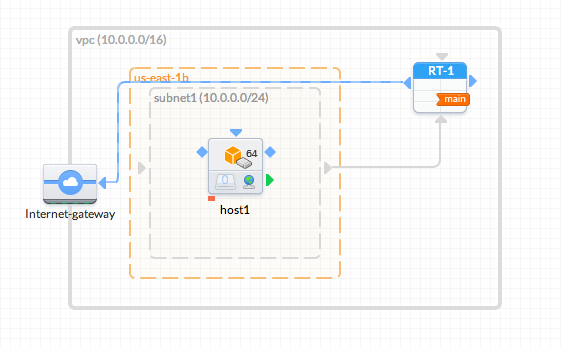 

Step by Step guide to configuring a VPC with a Public Subnet (you may want to have a look at the <a href="" style="color: red;">Classic mode - Part 1.</a> tutorial first, before creating a VPC)

1. Create a new VPC Stack, in the region of your choice: 
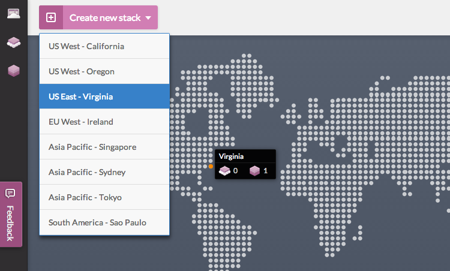 
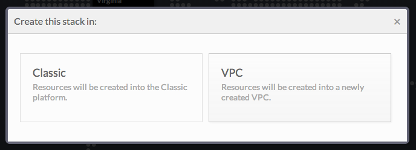 
2. A default VPC is created when you create a new VPC Stack, as well as a default <a href="http://docs.aws.amazon.com/AmazonVPC/latest/UserGuide/VPC_Route_Tables.html">Route Table</a>. 
You can optionaly edit the subnet details in the right pannel (don't forget to focus on the subnet by clicking on its blank area). The network address must be written following the <a href="http://en.wikipedia.org/wiki/Classless_Inter-Domain_Routing">CIDR</a> notation: 
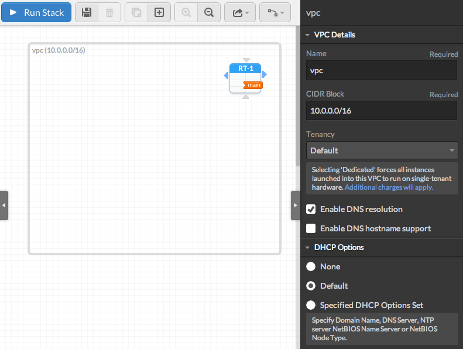
3. You can now add a new <a href="http://docs.aws.amazon.com/AWSEC2/latest/UserGuide/using-regions-availability-zones.html">Availability Zone</a> of your choice by drag-n-drop it from the left pannel: 
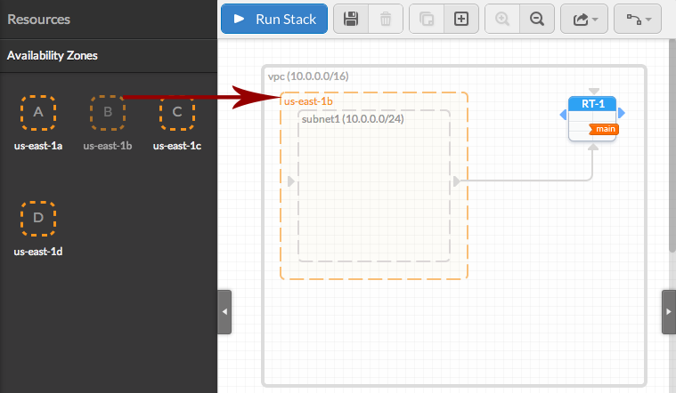
4. When adding a new Availability Zone, a default <a href="http://docs.aws.amazon.com/AmazonVPC/latest/UserGuide/VPC_Subnets.html">subnet</a> is created. 
You can edit the subnet properties in the right pannel: 
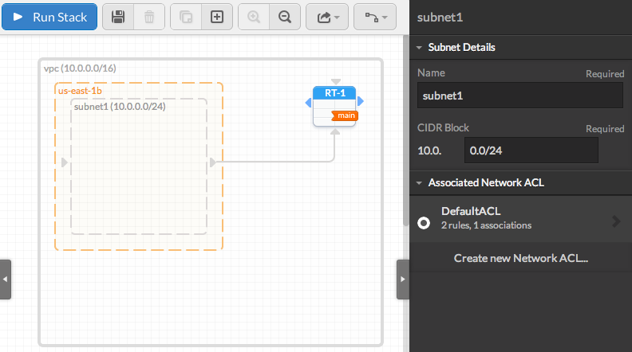 
Note that all Subnets are automatically connected to the Main Route Table. Subnets must be connected to only one Route Table.
5. Add an <a href="http://docs.aws.amazon.com/AmazonVPC/latest/UserGuide/VPC_Internet_Gateway.html">Internet Gateway</a> and connect it to the Route Table 
Drag an IGW from the resource panel (VPC category) to anywhere within the VPC. Note that the IGW will automatically snap to the left edge of the VPC and you can only have one IGW per VPC. 
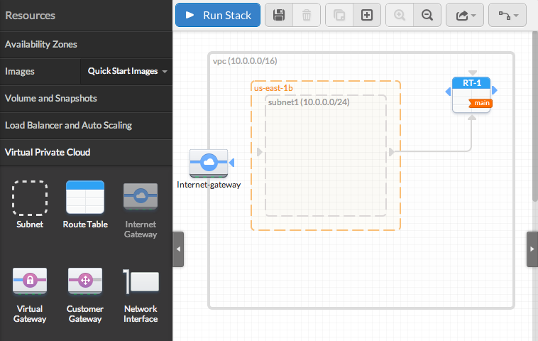 
6. You can now drag from the blue ports on the Route Table to the blue incoming port on the IGW to connect it. 
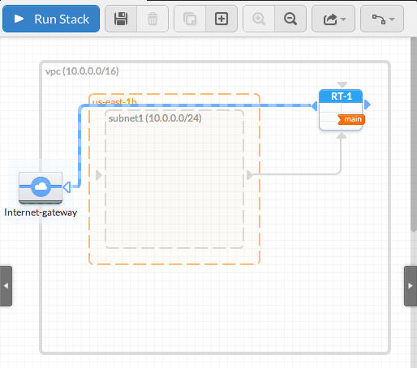 
7. You can edit the Route Table properties to define routing rules on the right pannel after selecting it. Note that when you connect an RT to an IGW we will automatically add a destination "0.0.0.0/0" rule. 
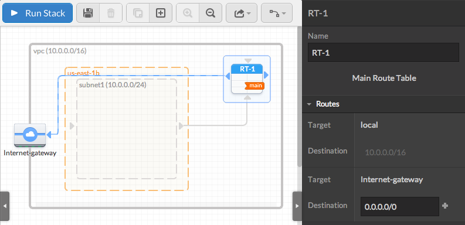 

####Optionally
You can stop there and save the Stack as a networking template or we can continue and launch it as an App.

1. Add an AMI to a Subnet 
We can now drag on an AMI from the resource panel to inside the Subnet in our VPC. 
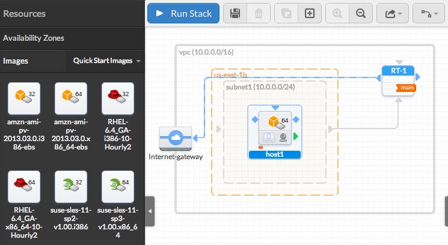 
2. Add an <a href="http://docs.aws.amazon.com/AWSEC2/latest/UserGuide/elastic-ip-addresses-eip.html">Elastic IP</a> 
Next click on the bottom-right icon of the instance to attach an EIP. 
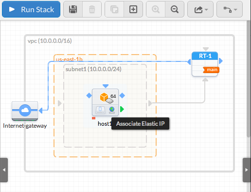 

Your VPC is now configured. Please, have a look at the <a href="" style="color: red;">Classic mode - Part 1.</a> tutorial to get more information about App creation.

####2.2 VPC with Public and Private Subnets
<a href="http://docs.aws.amazon.com/AmazonVPC/latest/UserGuide/VPC_Scenario2.html">Description</a>: "The configuration for this scenario includes a virtual private cloud (VPC) with a public subnet and a private subnet. The instances in the public subnet can receive inbound traffic directly from the Internet, whereas the instances in the private subnet can't. The instances in the public subnet can send outbound traffic directly to the Internet, whereas the instances in the private subnet can't. Instead, the instances in the private subnet can access the Internet by using a network address translation (NAT) instance that you launch into the public subnet."

The following diagram shows what we will create in this example: 
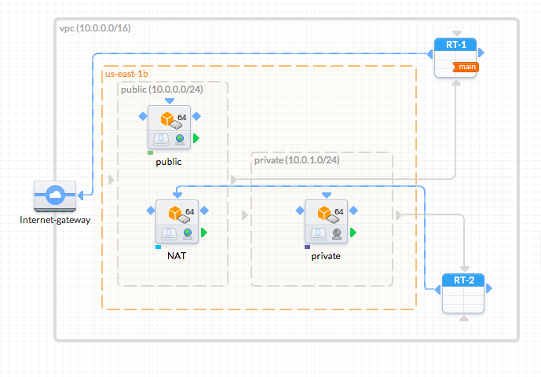 

Step by Step guide to configuring a VPC with Public and Private Subnets (you may want to have a look at the <a href="" style="color: red;">VPC Mode - VPC with a Public Subnet Only - Part 2.2.1</a> tutorial first, before creating this VPC.

1. Create a new VPC Stack, in the region of your choice: 
 
 
2. A default VPC is created when you create a new VPC Stack, as well as a default <a href="http://docs.aws.amazon.com/AmazonVPC/latest/UserGuide/VPC_Route_Tables.html">Route Table</a>. 
You can optionaly edit the subnet details in the right pannel (don't forget to focus on the subnet by clicking on its blank area). The network address must be written following the <a href="http://en.wikipedia.org/wiki/Classless_Inter-Domain_Routing">CIDR</a> notation: 

3. You can now add a new <a href="http://docs.aws.amazon.com/AWSEC2/latest/UserGuide/using-regions-availability-zones.html">Availability Zone</a> of your choice by drag-n-drop it from the left pannel: 

4. When adding a new Availability Zone, a default <a href="http://docs.aws.amazon.com/AmazonVPC/latest/UserGuide/VPC_Subnets.html">subnet</a> is created. 
You can edit the subnet properties in the right pannel 
 
Note that all Subnets are automatically connected to the Main Route Table. Subnets must be connected to only one Route Table.
5. Add another subnet by dragging it from the resources pannel and dropping it in the Availability Zone. 
Name one subnet "public" with the CIDR IP "10.0.0.0/24" and the other "private" with the CIDR IP "10.0.1.0/24" as following: 
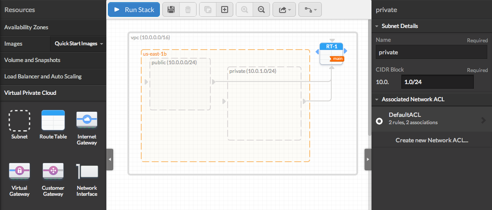 
6. Add an <a href="http://docs.aws.amazon.com/AmazonVPC/latest/UserGuide/VPC_Internet_Gateway.html">Internet Gateway</a> and connect it to the Route Table 
Drag an IGW from the resource panel (VPC category) to anywhere within the VPC. Note that the IGW will automatically snap to the left edge of the VPC and you can only have one IGW per VPC. 
Then, drag from the blue ports on the Route Table to the blue incoming port on the IGW to connect it. 
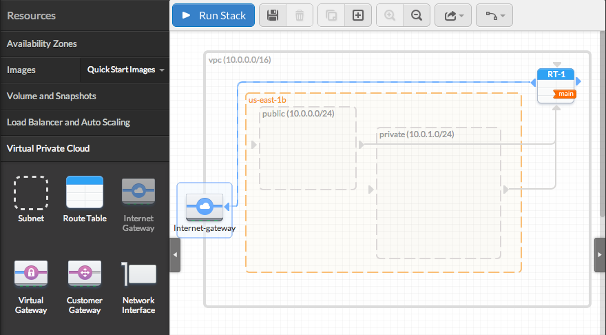 
7. You can click on the Route Table to define routing rules. Note that when you connect an RT to an IGW we will automatically add a destination "0.0.0.0/0" rule. 
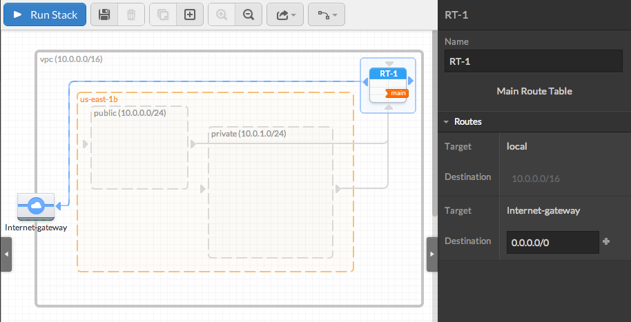 
8. Add another Route Table 
Drag another RT from the resource panel to anywhere in the VPC. We can then associate subnet "private" to this RT by dragging from the grey port on the right of the subnet to an incoming grey port on the RT. Note that, as subnets can only be associated with one RT, the previous association will automatically be removed. 
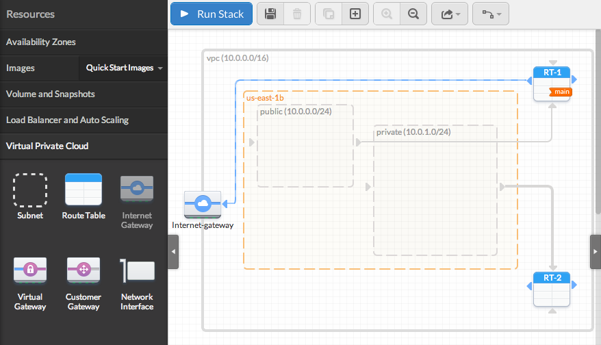 
9. Add the AMIs to the Subnets 
We can now drag on some AMIs from the resource panel to inside the Subnets in our VPC.  
Let's start by dragging two 64 bit Amazon Linux AMIs, one to each subnet. Optionally, click on the instances to rename the hosts in the right pannel. 
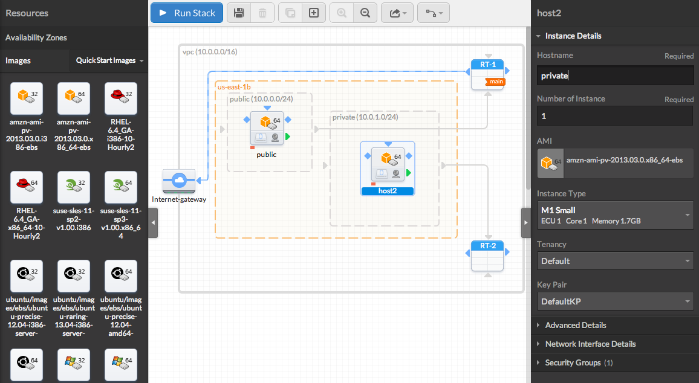  
Also add a NAT instance to the "public" subnet. You can find a Amazon Linux NAT AMI in the Quickstart AMIs. Drag it to the public subnet and name it "NAT". 
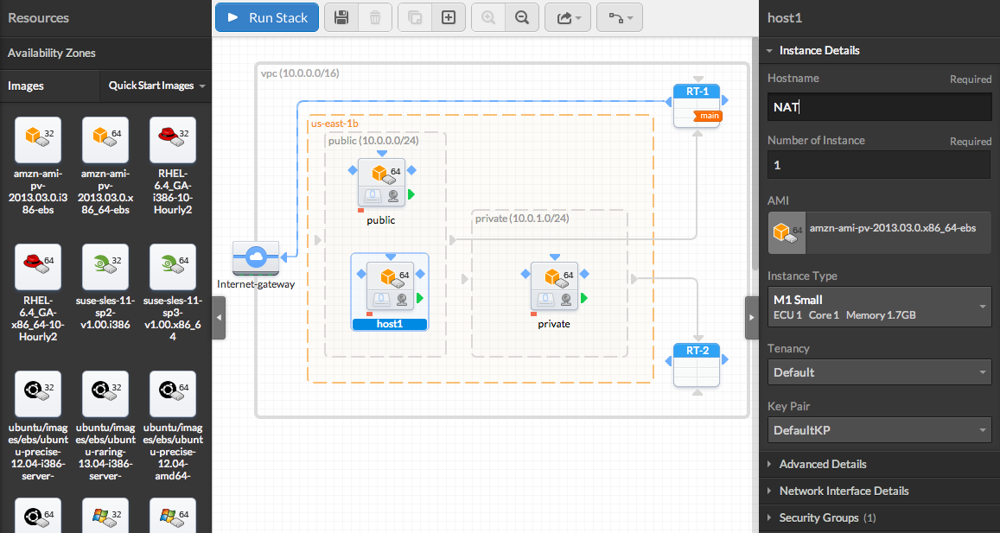
10. Connect the NAT and configure the RT 
Connect the RT to the NAT AMI by dragging from its outgoing blue port to the incoming blue port on the left of the NAT AMI.  
Enter "0.0.0.0/0" as "Destination" in the right pannel. 
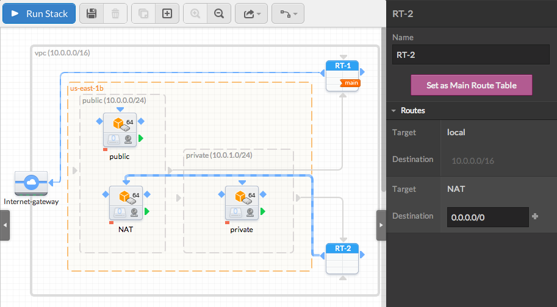
11. Configure the AMI IPs 
Click an AMI and select "Network Interface Details" in the right pannel. Here you can manually specify the IP address within the subnet range (".x" means auto assign random IP) and click the icon on the right to add an Elastic IP to a private IP. 
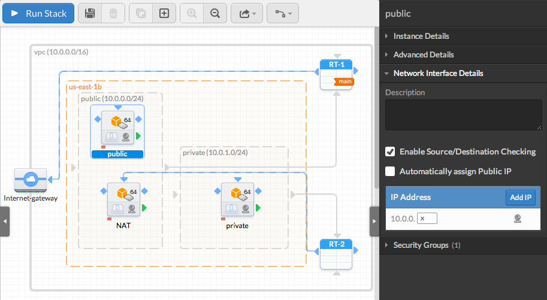 
Go ahead and use the following IP configurations: <table>
<tbody><tr><th>Subnet</th>
<th>Host</th>
<th>Private IP</th>
<th>Elastic IP</th>
</tr><tr><td>public</td>
<td>NAT</td>
<td>10.0.0.x</td>
<td>Yes</td>
</tr><tr><td>public</td>
<td>public</td>
<td>10.0.0.5</td>
<td>Yes</td>
</tr><tr><td>private</td>
<td>private</td>
<td>10.0.1.5</td>
<td>No</td>
</tr></tbody>
</table> 
12. Create and Configure Security Groups for each AMI 
Click an AMI and select "Security Groups" on the right pannel. Here you can create some new Security groups.  
Configure the Security Groups as following: <table><tbody><tr><th>AMI</th>
<th>SG Name</th>
</tr><tr><td>NAT</td>
<td>NATSG</td>
</tr><tr><td>public</td>
<td>WebServerSG</td>
</tr><tr><td>private</td>
<td>DBServerSG</td>
</tr></tbody></table>
You can now add the following rules to the Security Groups (see the <a href="" style="color: red;">Classic mode - Part 1.</a> tutorial before to know how to create Security Rules): <table><tbody><tr><td rowspan="2">SG</td>
<td rowspan="2">AMI</td>
<td colspan="4">Security Group Rules</td>
</tr><tr style="border-bottom: 1px solid gray;"><td>In / Out</td>
<td>Soure / Dest</td>
<td>Protocol</td>
<td>Port Range</td>
</tr><tr><td rowspan="8">WebServerSG</td>
<td rowspan="8">public</td>
<td rowspan="4" style="border-left: 1px solid gray;">In</td>
<td>0.0.0.0/0</td>
<td>TCP</td>
<td>80</td>
</tr><tr><td>0.0.0.0/0</td>
<td>TCP</td>
<td>443</td>
</tr><tr><td>Your network’s public IP address range</td>
<td>TCP</td>
<td>22</td>
</tr><tr style="border-bottom: 1px solid gray;"><td>Your network’s public IP address range</td>
<td>TCP</td>
<td>3389</td>
</tr><tr><td rowspan="4" style="border-left: 1px solid gray;">Out</td>
<td>0.0.0.0/0</td>
<td>TCP</td>
<td>80</td>
</tr><tr><td>0.0.0.0/0</td>
<td>TCP</td>
<td>443</td>
</tr><tr><td>private.private_ip_address</td>
<td>TCP</td>
<td>1433</td>
</tr><tr style="border-bottom: 1px solid gray;"><td>private.private_ip_address</td>
<td>TCP</td>
<td>3306</td>
</tr><tr><td rowspan="4">DBServerSG</td>
<td rowspan="4">private</td>
<td rowspan="2" style="border-left: 1px solid gray;">In</td>
<td>public.private_ip_address</td>
<td>TCP</td>
<td>1433</td>
</tr><tr style="border-bottom: 1px solid gray;"><td>public.private_ip_address</td>
<td>TCP</td>
<td>3306</td>
</tr><tr><td rowspan="2" style="border-left: 1px solid gray;">Out</td>
<td>0.0.0.0/0</td>
<td>TCP</td>
<td>80</td>
</tr><tr style="border-bottom: 1px solid gray;"><td>0.0.0.0/0</td>
<td>TCP</td>
<td>443</td>
</tr><tr><td rowspan="5">NATSG</td>
<td rowspan="5">NAT</td>
<td rowspan="3" style="border-left: 1px solid gray;">In</td>
<td>10.0.1.0/24</td>
<td>TCP</td>
<td>80</td>
</tr><tr><td>10.0.1.0/24</td>
<td>TCP</td>
<td>443</td>
</tr><tr style="border-bottom: 1px solid gray;"><td>Your network’s public IP address range</td>
<td>TCP</td>
<td>22</td>
</tr><tr><td rowspan="2" style="border-left: 1px solid gray;">Out</td>
<td>0.0.0.0/0</td>
<td>TCP</td>
<td>80</td>
</tr><tr><td>0.0.0.0/0</td>
<td>TCP</td>
<td>443</td>
</tr></tbody></table>

####2.3 VPC with Public and Private Subnets and Hardware VPN Access
<a href="http://docs.aws.amazon.com/AmazonVPC/latest/UserGuide/VPC_Scenario3.html">Description</a>: “The configuration for this scenario includes a virtual private cloud (VPC) with a public subnet and a private subnet, and a virtual private gateway to enable communication with your own network over an IPsec VPN tunnel. We recommend this scenario if you want to extend your network into the cloud and also directly access the Internet from your VPC. This scenario enables you to run a multi-tiered application with a scalable web front end in a public subnet, and to house your data in a private subnet that is connected to your network by an IPsec VPN connection.”

The following diagram shows what we will create in this example: 
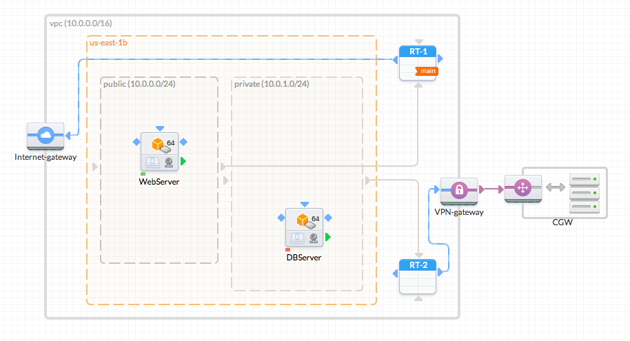 

Step by Step guide to configuring a VPC with Public Subnet and Private Subnets and Hardware VPN Access (you may want to have a look at the <a href="" style="color: red;">VPC Mode - VPC with Public and Private Subnets - Part 2.2.2</a> tutorial first, before creating this VPC.

1. Create a new VPC Stack, in the region of your choice: 
 
 
2. A default VPC is created when you create a new VPC Stack, as well as a default <a href="http://docs.aws.amazon.com/AmazonVPC/latest/UserGuide/VPC_Route_Tables.html">Route Table</a>. 
You can optionaly edit the subnet details in the right pannel (don't forget to focus on the subnet by clicking on its blank area). The network address must be written following the <a href="http://en.wikipedia.org/wiki/Classless_Inter-Domain_Routing">CIDR</a> notation: 

3. You can now add a new <a href="http://docs.aws.amazon.com/AWSEC2/latest/UserGuide/using-regions-availability-zones.html">Availability Zone</a> of your choice by drag-n-drop it from the left pannel: 

4. When adding a new Availability Zone, a default <a href="http://docs.aws.amazon.com/AmazonVPC/latest/UserGuide/VPC_Subnets.html">subnet</a> is created. 
You can edit the subnet properties in the right pannel 
 
Note that all Subnets are automatically connected to the Main Route Table. Subnets must be connected to only one Route Table.
5. Add another subnet by dragging it from the resources pannel and dropping it in the Availability Zone. 
Name one subnet "public" with the CIDR IP "10.0.0.0/24" and the other "private" with the CIDR IP "10.0.1.0/24" as following: 
 
6. Add an <a href="http://docs.aws.amazon.com/AmazonVPC/latest/UserGuide/VPC_Internet_Gateway.html">Internet Gateway</a> and connect it to the Route Table 
Drag an IGW from the resource panel (VPC category) to anywhere within the VPC. Note that the IGW will automatically snap to the left edge of the VPC and you can only have one IGW per VPC. 
Then, drag from the blue ports on the Route Table to the blue incoming port on the IGW to connect it. 
 
7. You can click on the Route Table to define routing rules. Note that when you connect an RT to an IGW we will automatically add a destination "0.0.0.0/0" rule. 
 
8. Add another Route Table 
Drag another RT from the resource panel to anywhere in the VPC. We can then associate subnet "private" to this RT by dragging from the grey port on the right of the subnet to an incoming grey port on the RT. Note that, as subnets can only be associated with one RT, the previous association will automatically be removed. 
 
9. Add a <a href="http://docs.aws.amazon.com/AmazonVPC/latest/UserGuide/VPC_VPN.html">Virtual Private Gateway</a> and Connect it to the Route Table 
Drag a VGW in to the VPC. Note that it will snap to the right side of the VPC. Once added, connect the left blue port of the VGW to the blue incoming port of the RT associated with the Private subnet. The RT configuration dialogue will automatically appear. Enter the Destination "172.16.0.0/12" in the right pannel. 
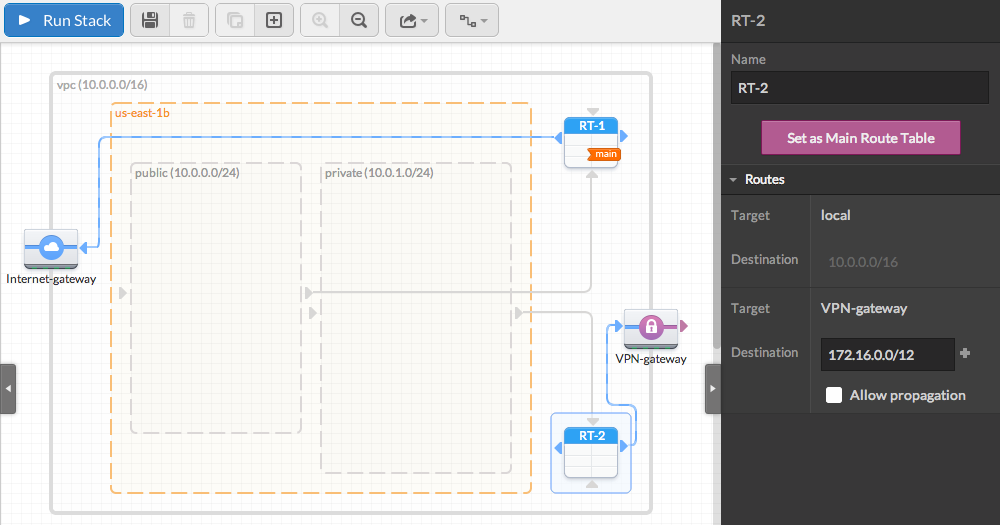 
10. Add a <a href="http://docs.aws.amazon.com/AmazonVPC/latest/NetworkAdminGuide/Introduction.html">Customer Gateway</a> 
Drag a CGW to the canvas. Note that it must be outside the VPC. After have added the CGW you must enter the IP address of your CGW, e.g., "203.0.113.12". You can rename it as you wish. 
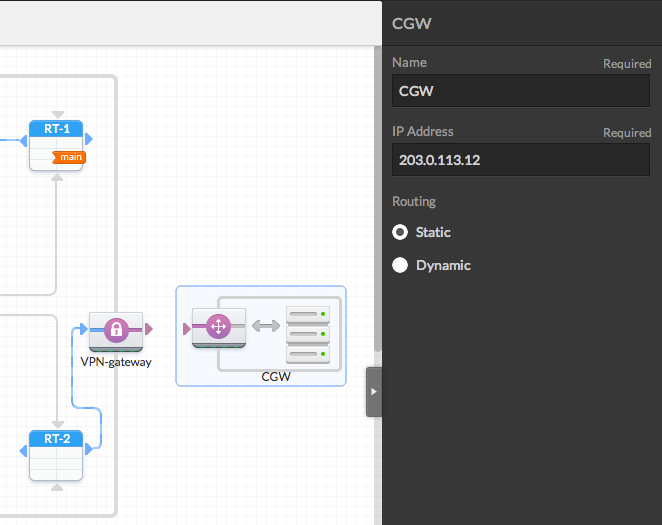 
11. Connect the CGW and VGW with a VPN Connection 
Connect the purple ports of the VGW and CGW to create a VPN. You must enter your VPN CIDR, e.g., "172.16.0.0/24", in the right pannel. 
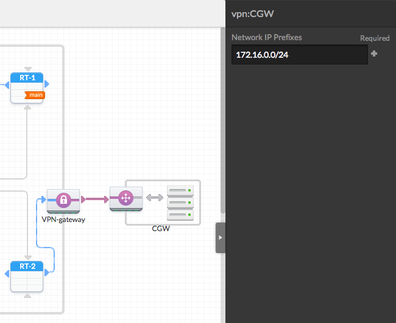 
12. Add AMIs to the Subnets 
Drag in some AMIs to the Subnets and rename them. 
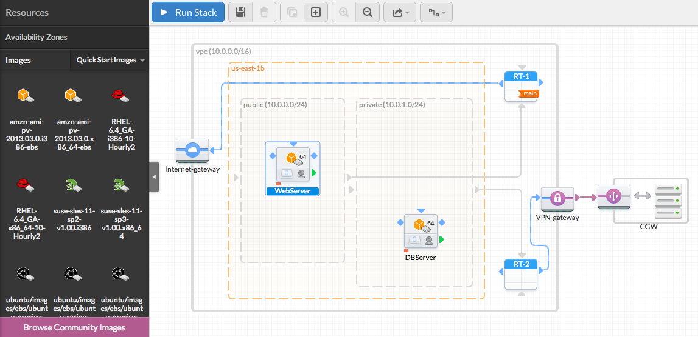 
13. Create and Configure Security Groups for each AMI 
Click an AMI and select "Security Groups" in the right pannel. Here you can create a custom SG for each AMI and remove them from "Default SG". 
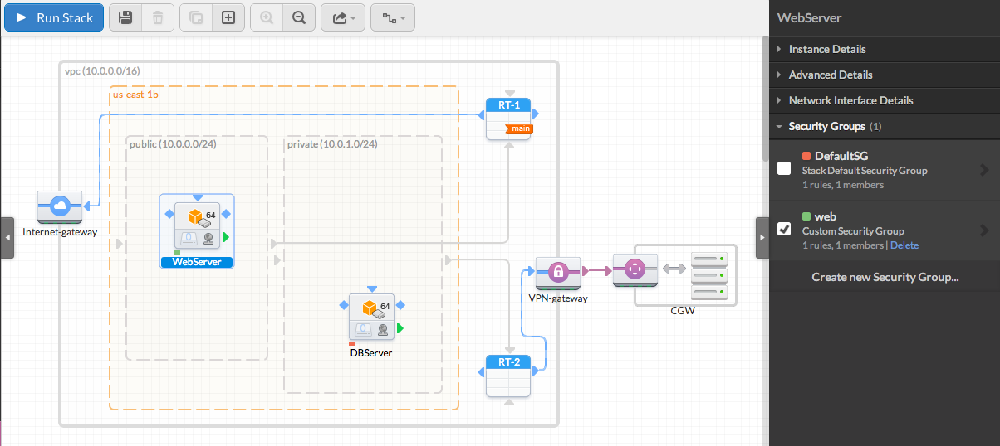 
14. Connect the AMIs and Configure the Security Groups 
You can define the Security Rules in each SG properties.  
Define it as follow: <table><tbody><tr><td rowspan="2">SG</td>
<td rowspan="2">AMI</td>
<td colspan="4">Security Group Rules</td>
</tr><tr style="border-bottom: 1px solid gray;"><td>In / Out</td>
<td>Soure / Dest</td>
<td>Protocol</td>
<td>Port Range</td>
</tr><tr><td rowspan="8">WebServerSG</td>
<td rowspan="8">WebServer</td>
<td rowspan="4" style="border-left: 1px solid gray;">In</td>
<td>0.0.0.0/0</td>
<td>TCP</td>
<td>80</td>
</tr><tr><td>0.0.0.0/0</td>
<td>TCP</td>
<td>443</td>
</tr><tr><td>Your network’s public IP address range</td>
<td>TCP</td>
<td>22</td>
</tr><tr style="border-bottom: 1px solid gray;"><td>Your network’s public IP address range</td>
<td>TCP</td>
<td>3389</td>
</tr><tr><td rowspan="4" style="border-left: 1px solid gray;">Out</td>
<td>0.0.0.0/0</td>
<td>TCP</td>
<td>80</td>
</tr><tr><td>0.0.0.0/0</td>
<td>TCP</td>
<td>443</td>
</tr><tr><td>DBServer.private_ip_address</td>
<td>TCP</td>
<td>1433</td>
</tr><tr style="border-bottom: 1px solid gray;"><td>DBServer.private_ip_address</td>
<td>TCP</td>
<td>3306</td>
</tr><tr><td rowspan="6">DBServerSG</td>
<td rowspan="6">DBServer</td>
<td rowspan="4" style="border-left: 1px solid gray;">In</td>
<td>WebServer.private_ip_address</td>
<td>TCP</td>
<td>1433</td>
</tr><tr><td>WebServer.private_ip_address</td>
<td>TCP</td>
<td>3306</td>
</tr><tr><td>172.16.0.0/24</td>
<td>TCP</td>
<td>22</td>
</tr><tr style="border-bottom: 1px solid gray;"><td>172.16.0.0/24</td>
<td>TCP</td>
<td>3389</td>
</tr><tr><td rowspan="2" style="border-left: 1px solid gray;">Out</td>
<td>0.0.0.0/0</td>
<td>TCP</td>
<td>80</td>
</tr><tr><td>0.0.0.0/0</td>
<td>TCP</td>
<td>443</td>
</tr></tbody></table>
15. Configure DHCP Options Set 
You can edit the VPC properties to configure DHCP in the right pannel. 
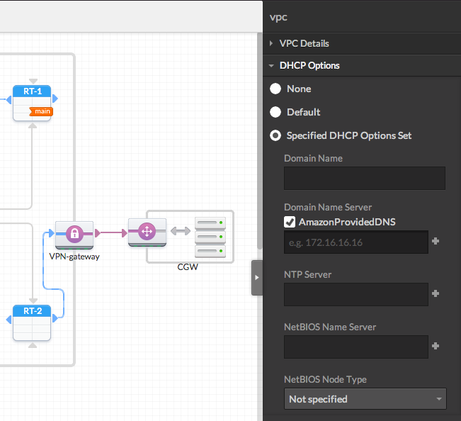

####2.4 VPC with a Private Subnet Only and Hardware VPN Access
<a href="http://docs.aws.amazon.com/AmazonVPC/latest/UserGuide/VPC_Scenario4.html">Description</a>: “The configuration for this scenario includes a virtual private cloud (VPC) with a single private subnet, and a virtual private gateway to enable communication with your own network over an IPsec VPN tunnel. There is no Internet gateway to enable communication over the Internet. We recommend this scenario if you want to extend your network into the cloud using Amazon's infrastructure without exposing your network to the Internet.”

The following diagram shows what we will create in this example: 
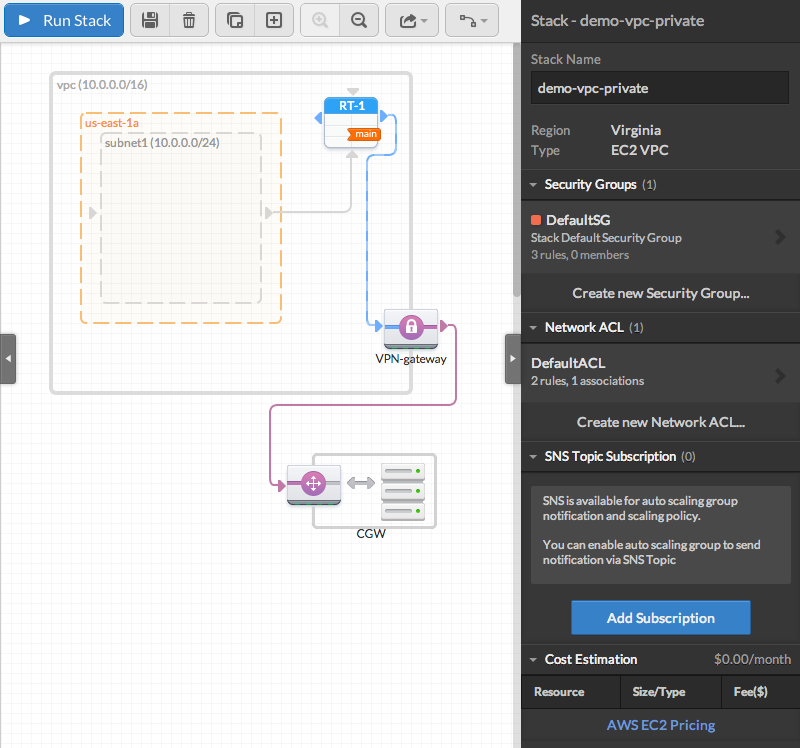 

Step by Step guide to configuring a VPC with a Private Subnet Only and Hardware VPN Access (you may want to have a look at the <a href="" style="color: red;">VPC Mode - VPC with Public and Private Subnets and Hardware VPN Access - Part 2.2.3</a> tutorial first, before creating this VPC.

1. Create a new VPC Stack, in the region of your choice: 
 
 
2. A default VPC is created when you create a new VPC Stack, as well as a default <a href="http://docs.aws.amazon.com/AmazonVPC/latest/UserGuide/VPC_Route_Tables.html">Route Table</a>. 
You can optionaly edit the subnet details in the right pannel (don't forget to focus on the subnet by clicking on its blank area). The network address must be written following the <a href="http://en.wikipedia.org/wiki/Classless_Inter-Domain_Routing">CIDR</a> notation: 

3. You can now add a new <a href="http://docs.aws.amazon.com/AWSEC2/latest/UserGuide/using-regions-availability-zones.html">Availability Zone</a> of your choice by drag-n-drop it from the left pannel: 
 
4. When adding a new Availability Zone, a default <a href="http://docs.aws.amazon.com/AmazonVPC/latest/UserGuide/VPC_Subnets.html">subnet</a> is created. 
You can edit the subnet properties in the right pannel: 
 
Note that all Subnets are automatically connected to the Main Route Table. Subnets must be connected to only one Route Table.
5. Add a Virtual Private Gateway and Connect it to the Route Table 
Drag a VGW in to the VPC. Note that it will snap to the right side of the VPC. Once added, connect the left blue port of the VGW to the blue incoming port of the RT. Then, enter the Destination "0.0.0.0/0" in the right pannel. 
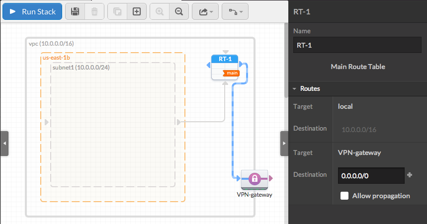 
6. Add a <a href="http://docs.aws.amazon.com/AmazonVPC/latest/NetworkAdminGuide/Introduction.html">Customer Gateway</a> 
Drag a CGW to the canvas. Note that it must be outside the VPC. After have added the CGW you must enter the IP address of your CGW, e.g., "203.0.113.12". You can rename it as you wish. 
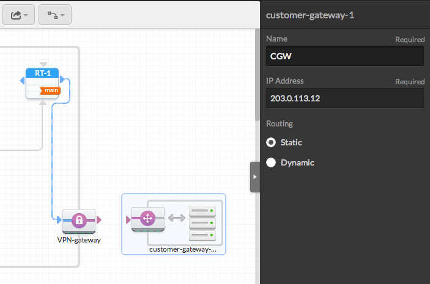 
7. Connect the CGW and VGW with a VPN Connection 
Connect the purple ports of the VGW and CGW to create a VPN. You must enter your VPN CIDR, e.g., "172.16.0.0/24", in the right pannel. 
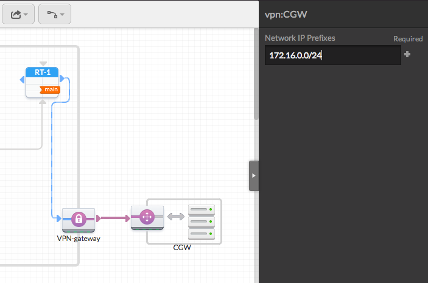 

##IDE interface
###1 Global details
###1.1 Description
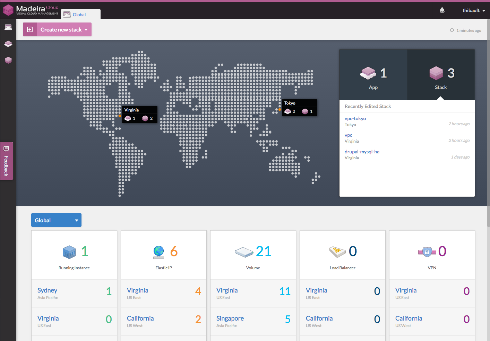 
MadeiraCloud IDE is a What You See Is What You Get editor for cloud applications. In other words, the project enables system architects to draw their infrastructure instead of writing it, reducing the time taken to design, provision, configure and connect distributed cloud resources.

The IDE is composed of three different screens:

- The dashboard
- The Stack edition
- The App monitoring

We will go through each of them in the following parts.

###1.2 Userbar
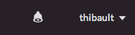 
The userbar is located on the top right of the IDE.

This bar has two main menus:

- The "alert" menu, aimed to list all the different alert/news/events 
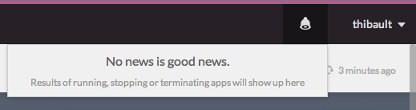 
- The "user" menu, aimed to list the different user parameters 
 

###2. Dashboard
####2.1 Description
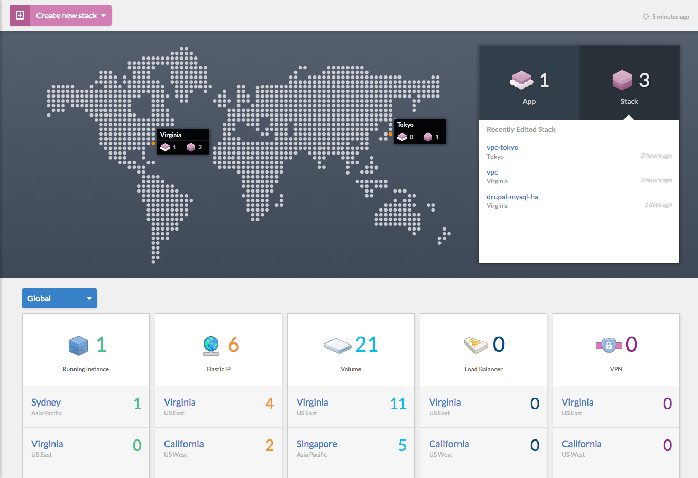  
The dashboard is a control center where you can control both your Madeira activiry and your AWS account activity and resources.

####Access
To access the dashboard, simply login to the IDE, or, at any point, you can go back to the dashboard by clicking on the first icon on the left menubar, then selecting the region of your choice.  
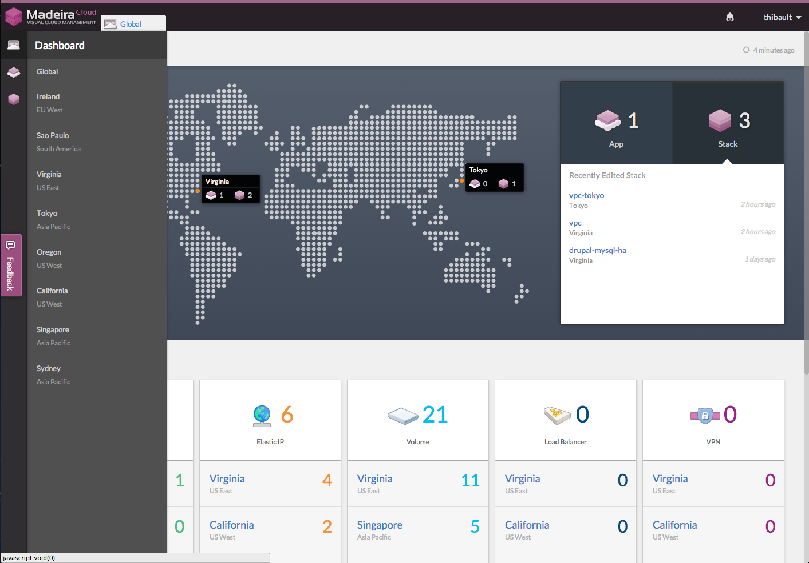 

####Stack creation button
A "Create new Stack" has been implemented to help you creating new Stacks with MadeiraCloud IDE. You can find it on the tol left of the dashboard. Please, go through <a href="" style="color: red;">Classic mode - Part 1.</a> tutorial to learn how to create a Stack.  
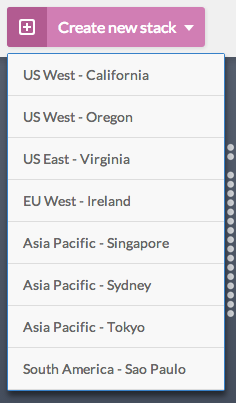 

####2.2 Main view
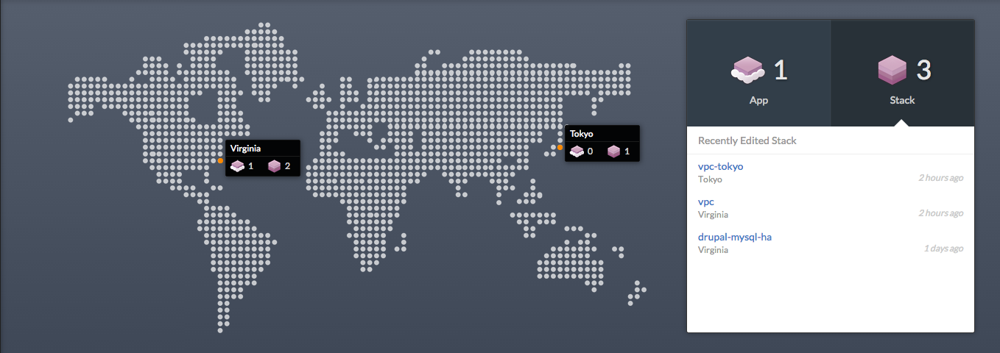  
The "Main View" is the top view of the dashboard, showing the number of App and Stack in every AWS region. The "Main View" is always displayed in the dashboard.

####2.3 Global Dashboard
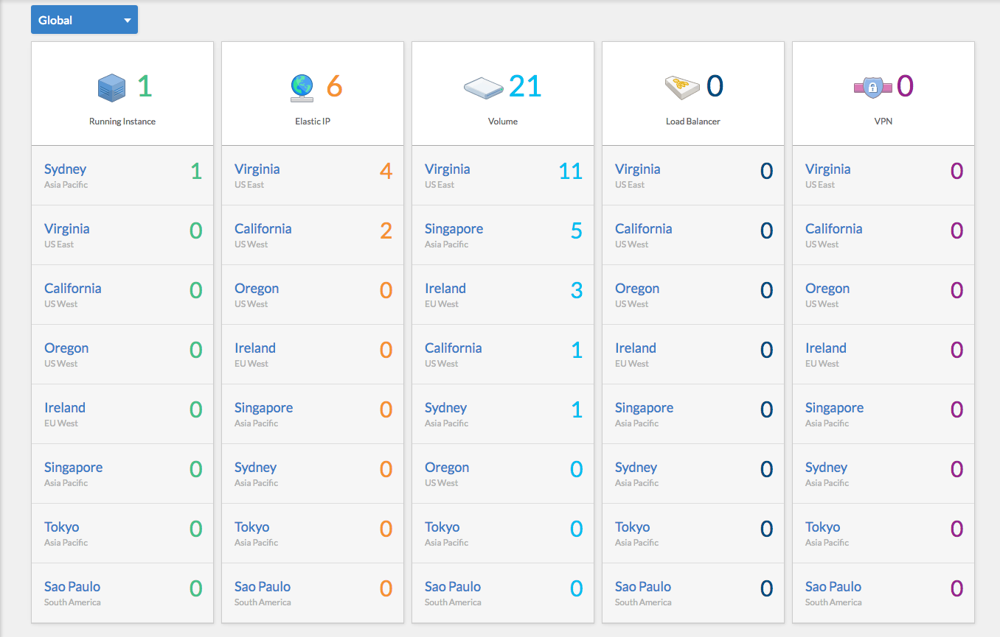  
The global Dashboard is an overview of the costful AWS resources in all AWS regions. 
This view helps to quickly determine which resources are currently in use and would cost money.

You can see there:

- <a href="http://aws.amazon.com/ec2/instance-types/">Running Instances</a>
- <a href="http://docs.aws.amazon.com/AWSEC2/latest/UserGuide/elastic-ip-addresses-eip.html">Elastic IPs</a>
- <a href="http://aws.amazon.com/ebs/">Volumes (EBS)</a>
- <a href="http://aws.amazon.com/elasticloadbalancing/">Load Balancers (ELB)</a>
- <a href="http://aws.amazon.com/vpc/">VPNs</a>

note: VPCs are not costful, however, VPN connections to VPCs are.

####2.4 Region specific Dashboard
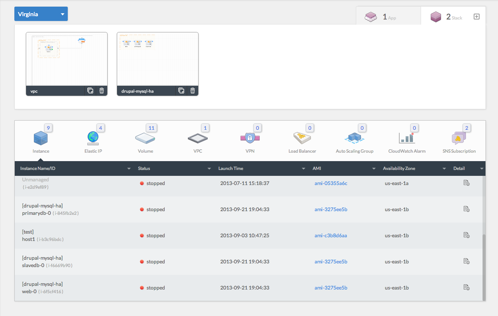  
The region specific Dashboard is an overview of different resources in a specific region.

This view is separated in two parts:

- The App/Stack view: You can see here the App and Stack created in this specific region using MadeiraCloud IDE
- The AWS resources view: You can see here the details of the most relevent AWS resources, wether or not created with MadeiraCloud IDE

####2.5 Details
You can get more details about a specific resource by clicking on the "Detail" icon, on the right of each resource. This will display you all the needed information about this resource.

For example, for an instance: 
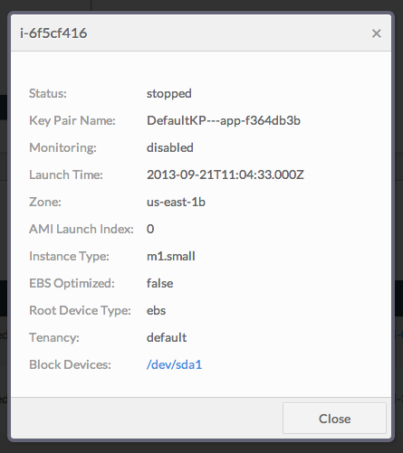

###3. Stack edition
####3.1 Description
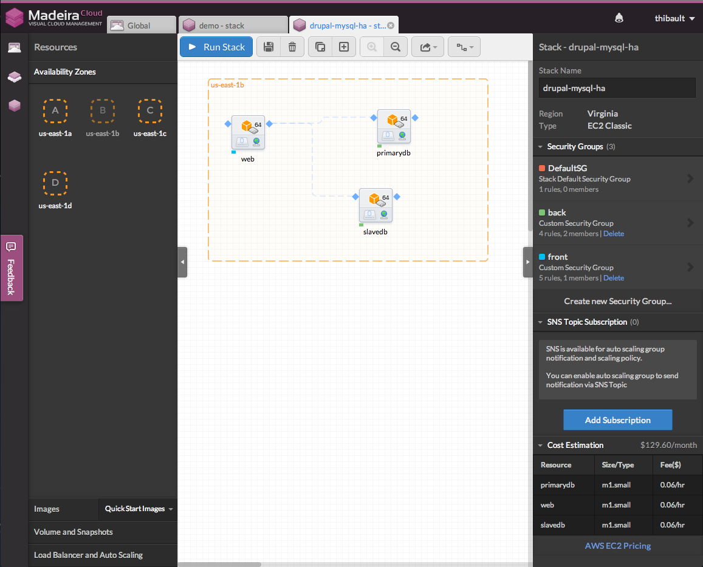  
The Stack screen is where you design your Cloud infrstructure.

####Composition
The Stack edition screen is mainly composed of four areas:

- The resources pannel on the left
- The property pannel on the right
- The edition canvas in the middle
- The tool bar on the top

####Access
To access the Stack edition screen, you can either create a new Stack or edit an already existing one. Simply click on any of the Stack creation button to create a new one, or click on the second icon on the left menubar, then select the Stack of your choice to edit an already existing Stack.  
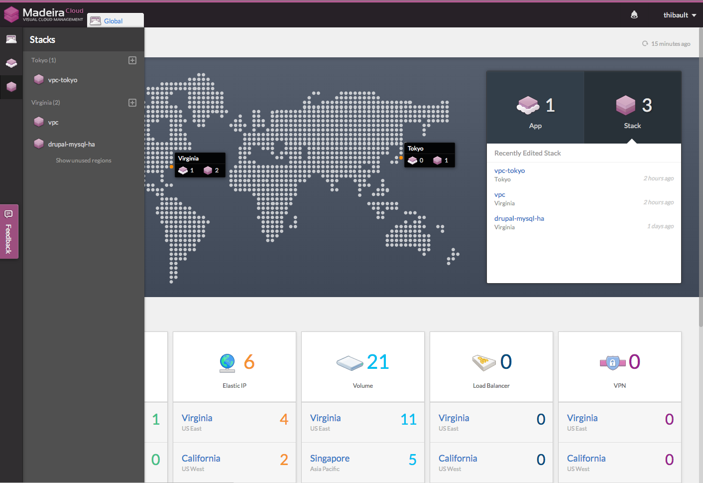 

####3.2 Resources
#####3.2.1 Availability Zones
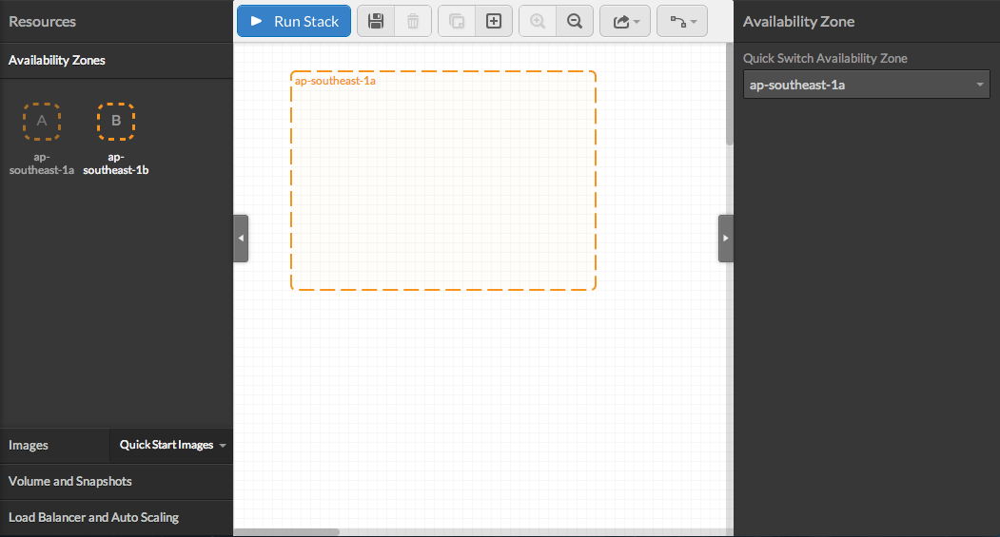  
The <a href="http://docs.aws.amazon.com/AWSEC2/latest/UserGuide/using-regions-availability-zones.html">Availability Zones</a> are the location of your resources on AWS, specific to each region.

You can switch to any other available AZ on the right pannel before running the Stack.

#####3.2.2 Images
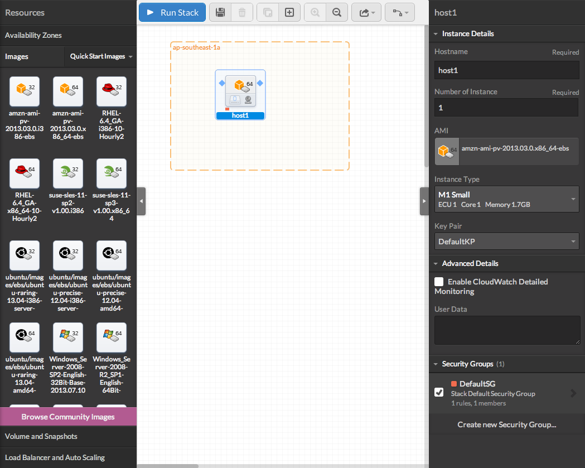  
The <a href="https://aws.amazon.com/amis">Images</a> represent the <a href="http://aws.amazon.com/ec2/instance-types/">EC2 Instances</a> with the <a href="https://aws.amazon.com/amis">AMI</a> of your choice.

You can edit the Instance/AMI properties in the right pannel. Note a field "Number of Instance", aimed to create groups of identical Instances (e.g. <a href="http://en.wikipedia.org/wiki/Computer_cluster">clustering</a>).

######Images source
You can select the AMIs source on the resources pannel. 
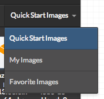

You can either get an AMI from the community by clicking in the "Browse Community Images" button. 
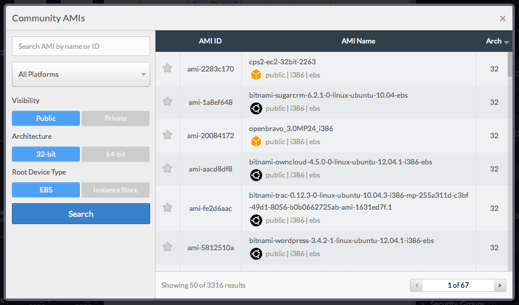

#####3.2.3 Volume and Snapshots
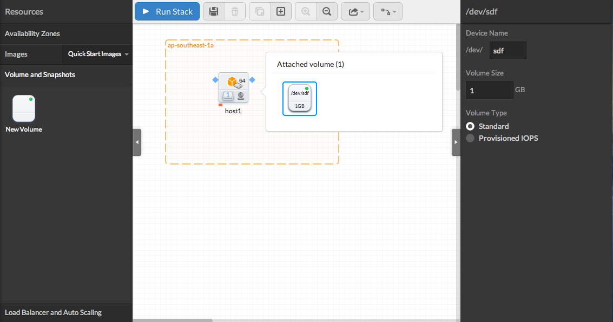  
The <a href="http://aws.amazon.com/ebs/">Volumes</a> are some additional drives that you can add to your instances in order to enhance the storage capacity. 
The <a href="http://aws.amazon.com/ebs/">Snapshots</a> describe a state of a device at a precise moment.

To attach a Volume to an Instance, simply drag it from the Resources pannel, then drop it on an instance. You can then configure the Volume in the right pannel.

#####3.2.4 Load Balancer and Auto Scaling
######Load Balancers
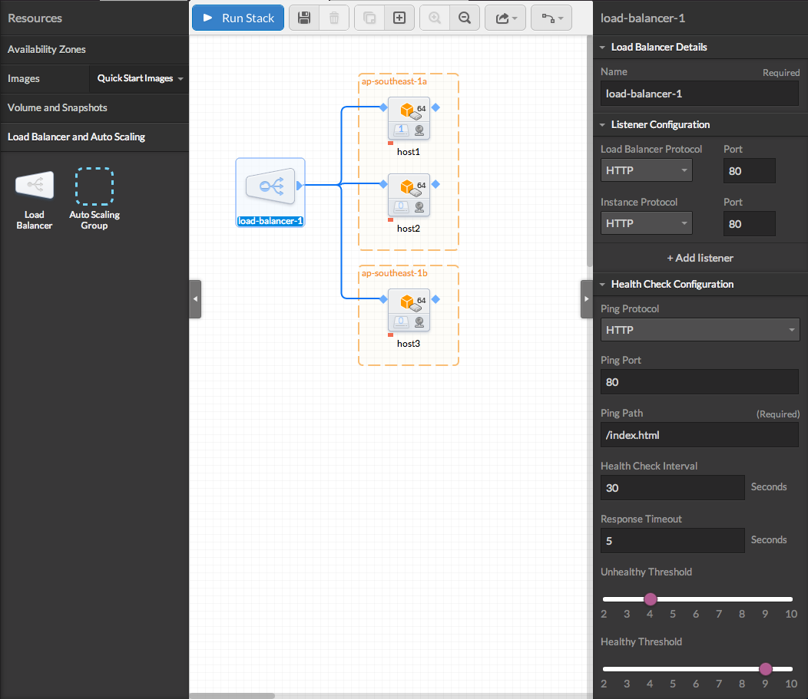  
The <a href="http://aws.amazon.com/elasticloadbalancing/">Load Balancers (ELB)</a> are some pre-configured instances automatically distributing the incomming traffric accross multiple EC2 Instances.

Simply drag a load balancer from the Resources pannel then drop it outside of the Availability Zones. You can then link the load balancer to the instances. 
You can configure the load balances on the right pannel.

######Auto Scaling Groups
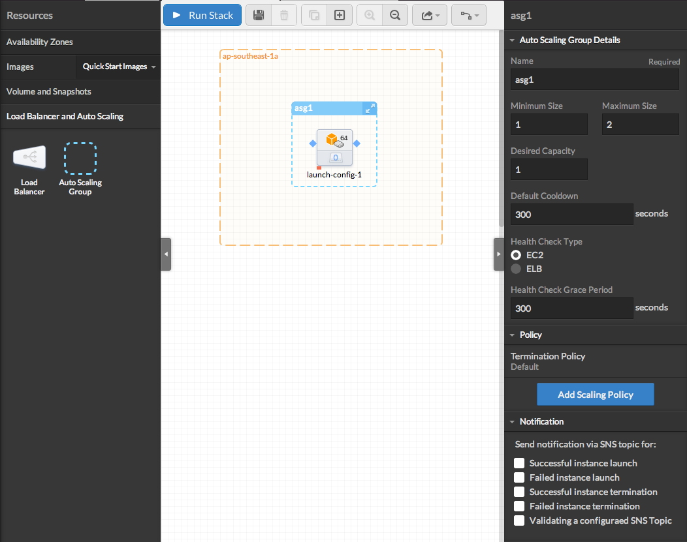  
The <a href="http://aws.amazon.com/autoscaling/">Auto Scaling Groups</a> are some containers with an automatically set number of instances.

Once the group placed inside an Availability Zone, you can drag and drop an AMI inside to define the type of instance to scale. 
You can then configure the Autoscaling Group in the right pannel.

####3.2.5 EIPs
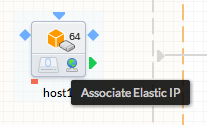  
The <a href="http://docs.aws.amazon.com/AWSEC2/latest/UserGuide/elastic-ip-addresses-eip.html">EIPs</a> are some static public IP address that you can associate to any instance/network card.

To activate an EIP, click on the bottom right icon of an instance in order to make it colored.

####3.2.6 Virtual Private Cloud (VPC Stack only)
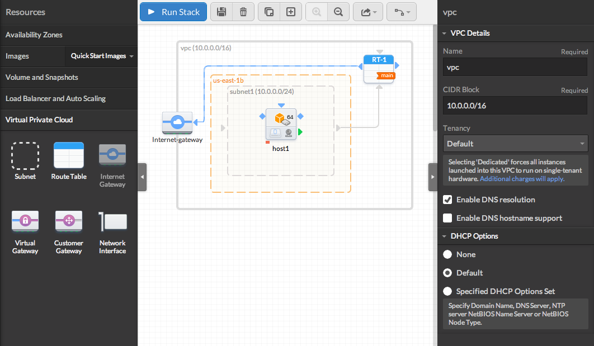  
A <a href="http://aws.amazon.com/vpc/">VPC</a> is a virtual private network within a cloud infrastructure, isolating the resources from the internet.

You can access the global VPC properties in the right pannel.

#####Subnet
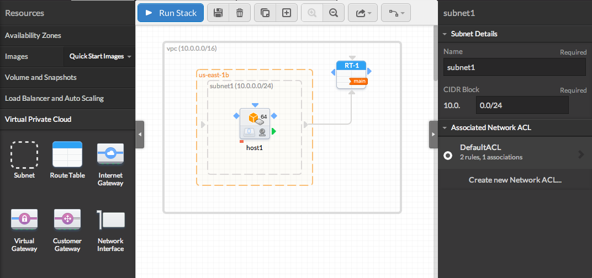  
A <a href="http://docs.aws.amazon.com/AmazonVPC/latest/UserGuide/VPC_Subnets.html">subnet</a> is, as its name implies, an isolated network inside a VPC. 
You must set here the subnet CIDR block. You can define as well some ACL rules.

#####Route Table
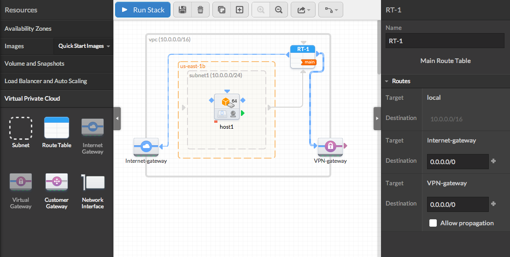  
A <a href="http://docs.aws.amazon.com/AmazonVPC/latest/UserGuide/VPC_Route_Tables.html">Route Table</a> is a table gathering the different routes associated to a subnet.

#####Internet Gateway
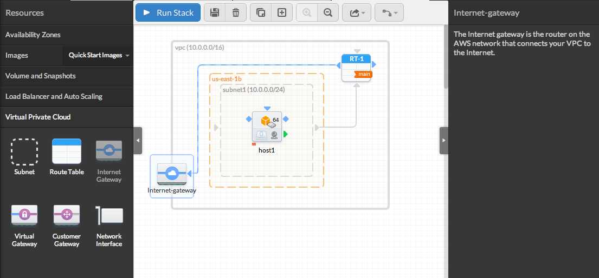  
An <a href="http://docs.aws.amazon.com/AmazonVPC/latest/UserGuide/VPC_VPN.html">Internet Gateway</a> makes the link between the Internet and the Route Tables.

#####Virtual Gateway
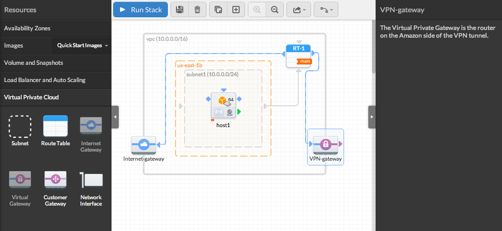  
A <a href="">Virtual Gateway</a> makes the link between a private VPN and the Route Tables.

#####Customer Gateway
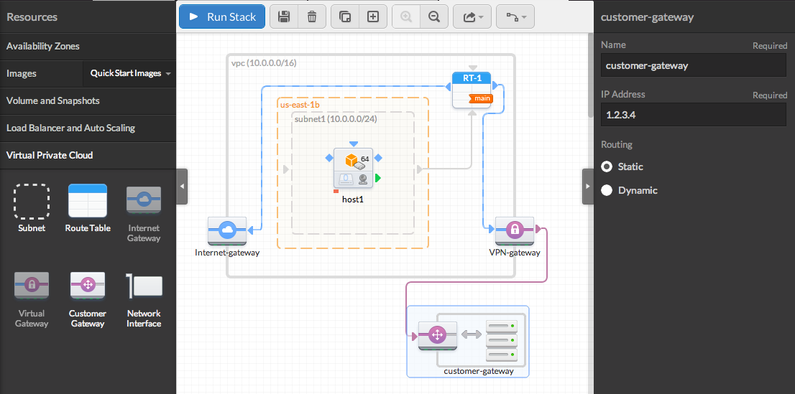  
A <a href="http://docs.aws.amazon.com/AmazonVPC/latest/NetworkAdminGuide/Introduction.html">Customer Gateway</a> is an indication of an external gateway owned by you (VPN endpoint). You must add the CGW ip address in the properties pannel.

When you link a VGW to a CGW, you must define the network prefix in the properties pannel. 
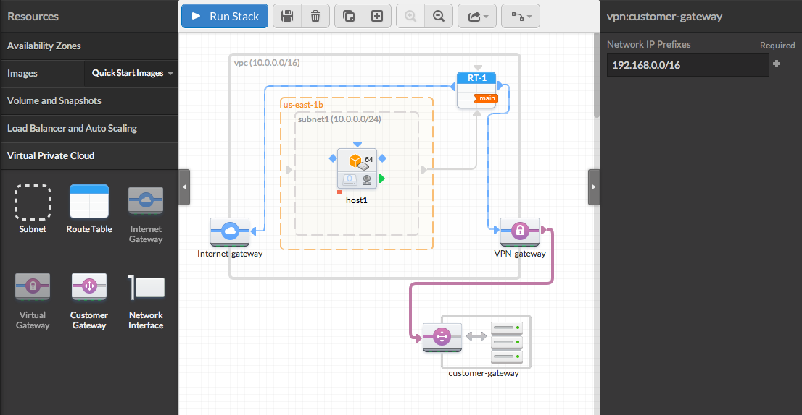

#####Network Interface
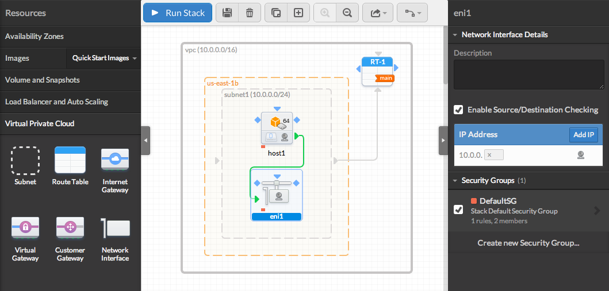  
A <a href="http://docs.aws.amazon.com/AWSEC2/latest/UserGuide/using-eni.html">Network Interface</a> is an additional network card that you can add to any instance. 
You can link the card to any instance and set the network properties in the right pannel.

####3.3 Top menu bar
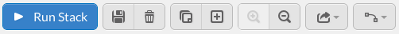  
The topbar provides the basical actions during the Stack edition:

- Run the Stack
- Save the Stack
- Delete the Stack
- Duplicate the Stack
- Create a new Stack
- Zoom in
- Zoom out
- Export (as png or json)
- Security Group rules links display

####3.4 Security
#####3.4.1 Security Groups
######Description
A <a href="http://docs.aws.amazon.com/AWSEC2/latest/UserGuide/using-network-security.html">Security Group</a> is a simplified packet-filtering firewall, helping you to controll the traffic through your infrastructure.

Note that this basic level security is a first and mandatory step to make an infrastructure secure. However, it must not be considered as a sufficient security to build a secure infrastructure. Please, start by reading this <a href="http://en.wikipedia.org/wiki/Firewall_(computing)">article</a>, for example, if you would like to know more about firewalling and security.

A Security Group is composed of one or more instance(s), and a set of rules. The rules can filter the incomming traffic (all Stacks) and outgoing traffic (VPC Stacks only).

The rules can defined as following:

- Incomming/Outgoing traffic
- Source (incomming) or destination (outgoing) IP address or range (CIDR notation, 0.0.0.0/0 for all)
- Source or destination port number or range (1-65535 for all)
- Protocol (TCP, UDP or ICMP)

The following instructions has been realized using a VPC Stack. For a normal Stack, the instructions should be similar, however, remember that it is not possible to define outgoing rules in normal Stacks, and we recommand you to setup your own firewall on every instance when using the normal Stacks.

######Default Security Group
A default Security Group is automatically generated when creating a new Stack. All instance added to this Stack will automatically be placed in this Security Group.

You can find and edit the Security Groups in the Stack or the instances properties (right pannel).

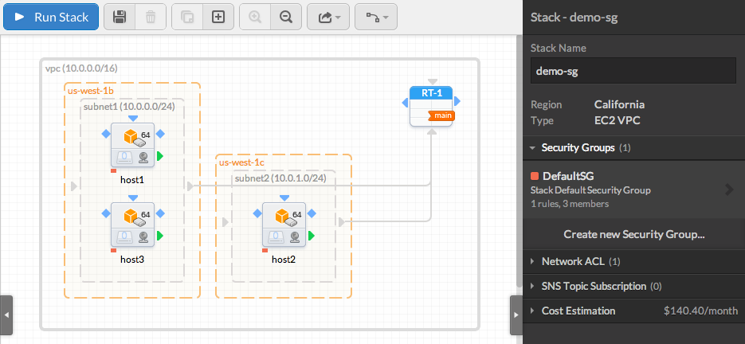

The Default Security Group already contains one rule, allowing all incomming TCP traffic on port 22 (SSH). This rule is mandatory if you want to manage your instance. However, you can reduce the IP range if you want to limit the users who can manage your instance.

######Create a custom Security Group
If you want to establish different rules for your instances, you need to create some custom Security Groups. You can them define, for each of them, the outgoing and incoming rules.

To create a custom Security Group, you can click on "Create new Security Group" just under the Security Groups list (instance or Stack properties, right pannel).

You will be automatically redirected to the rules definition pannel. Jump two topics ahead if you want to define your rules now, or go back, follow this tutorial and define it later.

We create two custom Security Groups for this example.

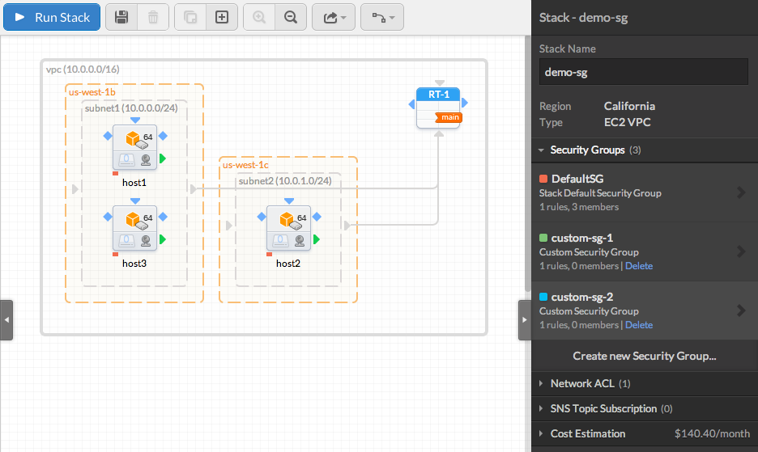

######Associate a custom Security Group
Once the custom Security Groups created, you can now add the instances inside the Security Groups. To do so, go on each instance properties, then Security Groups, tick the security group of your choice, then untick the DefaultSG.

You should see the colored square on the bottom left of your instance changing, according to the Security Group you are using. Note that an instance can be in several security groups (including the DefaultSG). See <a href="http://docs.aws.amazon.com/AWSEC2/latest/UserGuide/using-network-security.html">AWS Security Groups documentation</a> for more details about Security Groups themselves.

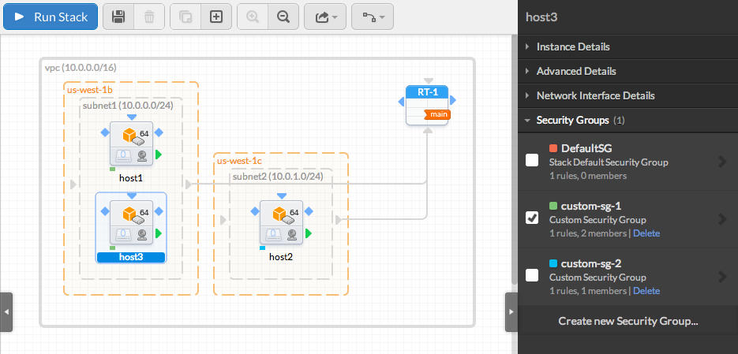

######Define Security Rules
You are now ready to create rules in your Security Groups.

To do so, click on the right arrow on the right side of the Security Group you want to edit.

Once in the Security Group details, click on the "+" next to "Rule" to add a new rule, a pop-up will come out.

This pop-up allows you to define the following rules:

- Direction (incoming or outgoing traffic)
- Source/Destination
	- IP/range (<a href="http://en.wikipedia.org/wiki/Classless_Inter-Domain_Routing">CIDR</a> notation)
	- Other Security Group
- Protocol
	- TCP: allow all TCP traffic on the selected port/range ("0-65535" for all)
	- UDP: allow all UDP traffic on the selected port/range ("0-65535" for all)
	- ICMP: select an ICMP packet type to allow (see the list for more details)
	- Custom: allow all traffic on a <a href="http://en.wikipedia.org/wiki/List_of_IP_protocol_numbers">custom protocol</a>
	- All: allow all traffic on the selected port/range ("0-65535" for all)

Here is a simple example with two web servers and one database server. We defined the following rules:
<table>
	<tbody>
		<tr>
			<td rowspan="2">SG</td>
			<td colspan="4">Security Group Rules</td>
		</tr>
		<tr style="border-bottom: 1px solid gray;">
			<td>In / Out</td>
			<td>Soure / Dest</td>
			<td>Protocol</td>
			<td>Port Range</td>
		</tr>
		<tr>
			<td rowspan="7">custom-sg-1</td>
			<td rowspan="3" style="border-left: 1px solid gray;">In</td>
			<td>IP range: 0.0.0.0/0</td>
			<td>TCP</td>
			<td>22</td>
		</tr>
		<tr>
			<td>IP range: 0.0.0.0/0</td>
			<td>TCP</td>
			<td>80</td>
		</tr>
		<tr>
			<td>SG: custom-sg-1</td>
			<td>All</td>
			<td>0-65535</td>
		</tr>
		<tr>
			<td rowspan="4" style="border-left: 1px solid gray;">Out</td>
			<td>IP range: 0.0.0.0/0</td>
			<td>TCP</td>
			<td>80</td>
		</tr>
		<tr>
			<td>IP range: 0.0.0.0/0</td>
			<td>TCP</td>
			<td>443</td>
		</tr>
		<tr>
			<td>SG: custom-sg-1</td>
			<td>All</td>
			<td>0-65535</td>
		</tr>
		<tr style="border-bottom: 1px solid gray;">
			<td>SG: custom-sg-2</td>
			<td>TCP</td>
			<td>3306</td>
		</tr>
		<tr>
			<td rowspan="6">custom-sg-2</td>
			<td rowspan="3" style="border-left: 1px solid gray;">In</td>
			<td>IP range: 0.0.0.0/0</td>
			<td>TCP</td>
			<td>22</td>
		</tr>
		<tr>
			<td>SG: custom-sg-1</td>
			<td>TCP</td>
			<td>3306</td>
		</tr>
		<tr style="border-bottom: 1px solid gray;">
			<td>SG: custom-sg-2</td>
			<td>All</td>
			<td>0-65535</td>
		</tr>
		<tr>
			<td rowspan="3" style="border-left: 1px solid gray;">Out</td>
			<td>IP range: 0.0.0.0/0</td>
			<td>TCP</td>
			<td>80</td>
		</tr>
		<tr>
			<td>IP range: 0.0.0.0/0</td>
			<td>TCP</td>
			<td>443</td>
		</tr>
		<tr>
			<td>SG: custom-sg-2</td>
			<td>All</td>
			<td>0-65535</td>
		</tr>
	</tbody>
</table>

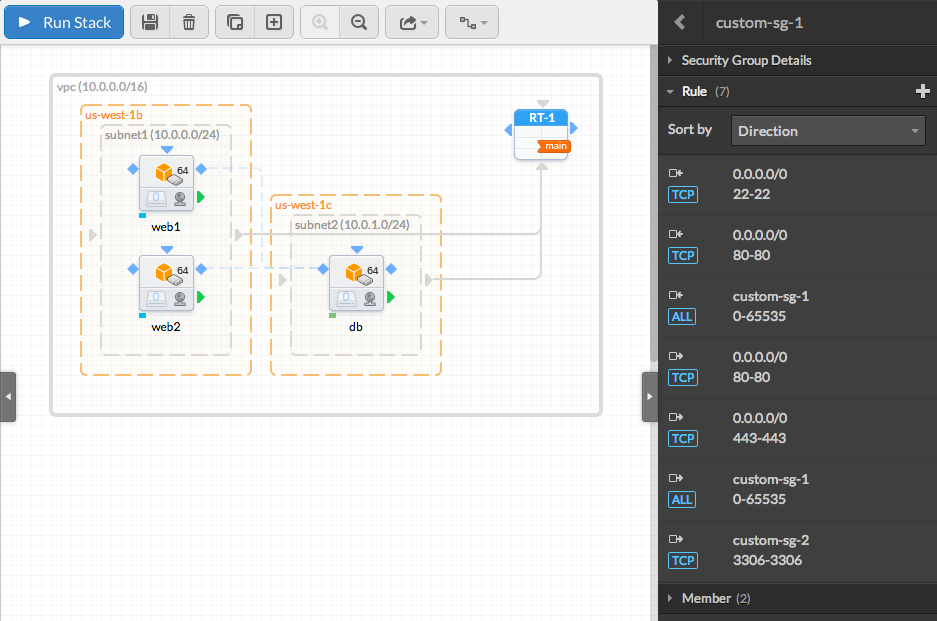

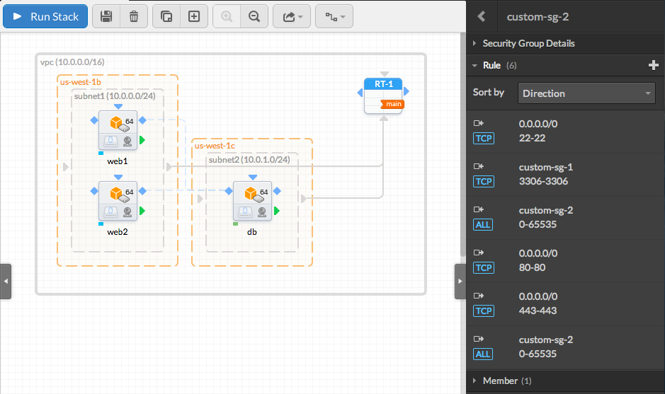

####3.4.2 Network ACL (VPC Stack only)
The Network ACL can be edited in the VPC properties.

The Network ACL acts as a complementary firewall to the Security Groups, to control an entire Subnet.

The ACL rules definition work the same way as Security Rules. It will not be described here, for more information about ACLs, please learn how to define Security Groups, then read <a href="http://docs.aws.amazon.com/AmazonVPC/latest/UserGuide/VPC_ACLs.html">this article</a>.

###4. App management

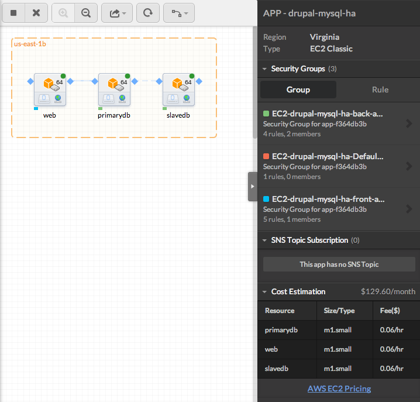

The App screen is where you monitor your running App(s).

####Composition
The App management screen is mainly composed of three areas:

- The App visualisation in the middle
- The property pannel on the right
- The tool bar on the top

####Access
To access the App management screen, you can either run a new Stack or view an already started one. Simply click on the "Run Stack" button to run a new Stack, or click on the third icon on the left menubar, then select the App of your choice to view an already existing App.

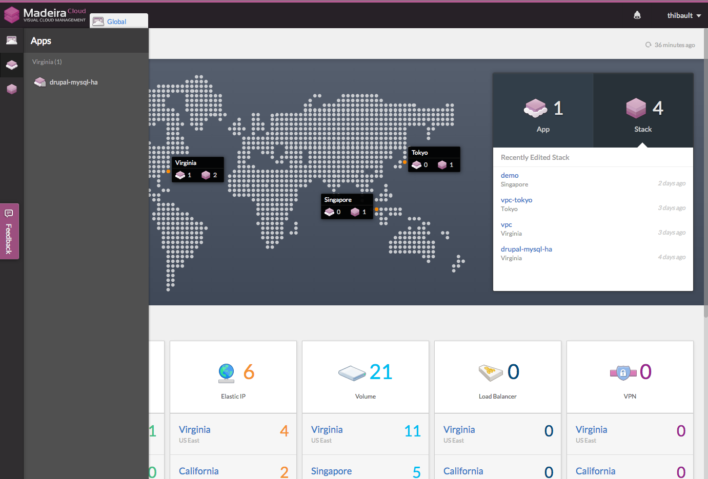

####Properties
You can display the properties of each element of your App from this screen.

In our example, simply click on an instance to display the properties on the right pannel.

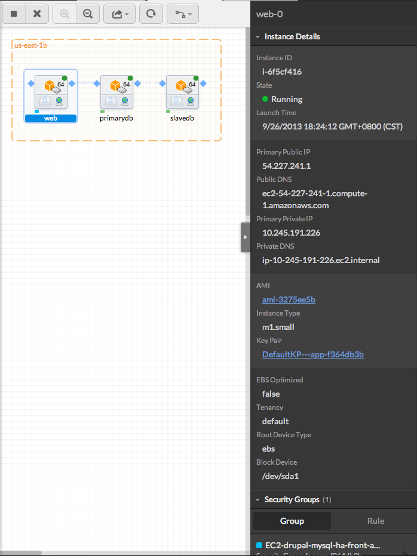
